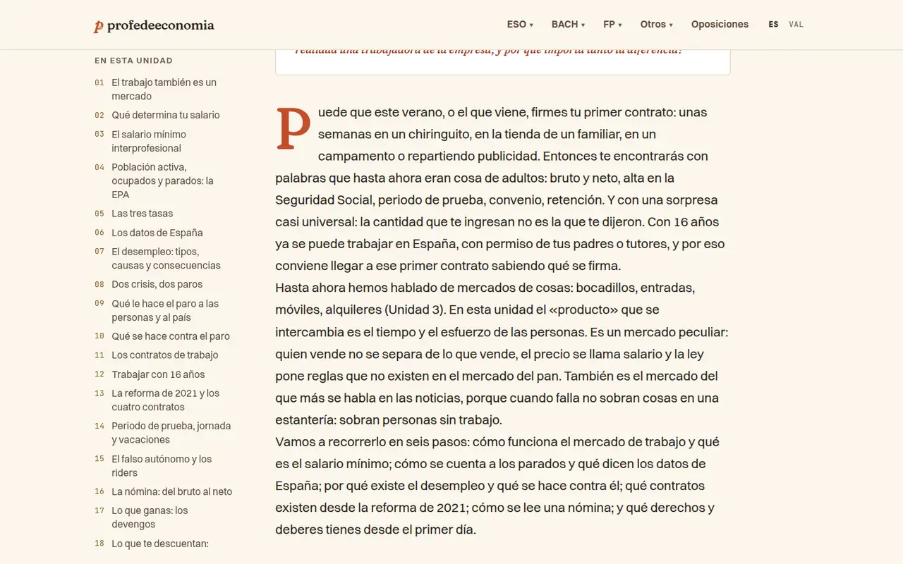
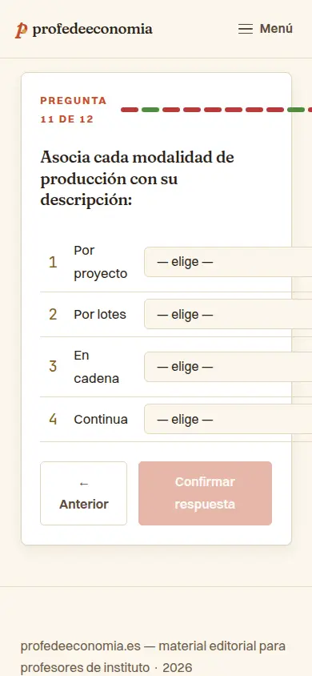

# Auditoria visual, estètica i UX/UI — setembre de 2026

> Part de l'[auditoria de setembre de 2026](../README.md). Revisió de només lectura sobre el build de producció de `main` (`876e002`), servit en local perquè el contenidor no té accés al web públic. Es contrasta amb la direcció validada (CLAUDE.md, Variant C), les regles de-slop de [`docs/design-system.md`](../../../design-system.md) i el mockup `mockups/variant-c/`. **No es proposa cap estètica nova**: cada proposta es queda dins de la direcció validada, i les decisions de gust queden per a Pau.

## Resum

La carcassa de la Variant C està ben implementada a la home, als hubs i a les landings transversals:

- Fraunces amb SOFT/WONK als títols i Switzer al cos.
- Paleta definida amb tokens i fonts allotjades al mateix domini.
- Molt d'aire i un patró d'hero coherent.
- Consentiment amb els dos botons idèntics.
- Menú mòbil sòlid.
- Un selector d'idioma que conserva la pàgina.

Els problemes es concentren en quatre fronts:

1. **El nucli de lectura del llibre.** El reset de Tailwind 4 s'ha menjat la separació entre paràgrafs i els marcadors de totes les llistes, a les 98 unitats. És el que més es veu de tot el web, i és un «llibre».
2. **L'arquitectura de la informació.** El catàleg ha passat de 4 assignatures i 3 seccions a 10 i 8 sense repensar les etiquetes:
   - «Otros» agrupa el que CLAUDE.md diu que no hi ha d'anar.
   - Hi ha dues «Herramientas».
   - «Olimpiada» i «Olimpiadas» porten a coses diferents.
   - No hi ha camí per unitat (de la unitat 7 al seu test, a les seues diapositives…).

   A més, algunes afirmacions ja no són certes: «tot és LOMLOE estatal» i «la misma estructura interna».
3. **Defectes mesurables en peces clau**:
   - El desplegable «Otros» es tanca o es talla a l'escriptori.
   - Les figures `wide` ixen a mitja columna.
   - El gràfic del punt mort té l'eix Y mal etiquetat.
   - Les diapositives tallen l'enunciat o la pregunta.
   - El QuizPlayer desborda al mòbil i perd el focus.
   - Les taules fan desplaçar tota la pàgina.
4. **Regles del sistema visual que ja existeixen però no s'apliquen del tot**:
   - Encara queden filets d'accent en un sol costat.
   - Queda un `✱`.
   - Els accents s'usen com a color de text per davall d'AA: terracota petita a 4,35:1, mostassa a 2,31:1, i el rètol dels CTA de descàrrega a 3,42:1 per culpa d'una regla global de `strong`.

**50 troballes: cap crítica, 21 altes, 22 mitjanes i 7 baixes.** Cap és crítica perquè sempre hi ha una alternativa, però diverses les veu qualsevol docent el primer dia.

| Annex | Àrea | Crític | Alt | Mitjà | Baix |
| --- | --- | ---: | ---: | ---: | ---: |
| [Entrada, navegació i arquitectura de la informació](./entrada-navegacio.md) | Home, hubs, menú, landings transversals, legals, consentiment | 0 | 7 | 13 | 5 |
| [Lectura, estudi i ferramentes](./lectura-estudi-eines.md) | Unitats del llibre, diapositives, activitats, tests, calculadores, reptes, reforç, programació, EBAU, jocs | 0 | 14 | 9 | 2 |
| **Total** | | **0** | **21** | **22** | **7** |

## Evidència automàtica

- **Mostra**: 47 pàgines representatives, en tres mides (mòbil 390×844, tauleta 820×1180 i escriptori 1440×900), més un escombratge a 320 px. En total, 519 captures, a les quals els auditors en van afegir un centenar amb interaccions (menú, teclat, quiz, calculadores, diapositives a 1920×1080).
- **Consentiment**: abans d'acceptar no es fa cap petició a tercers. GA4 només es carrega quan s'accepta.
- **Fonts**: Fraunces, Switzer i JetBrains Mono es carreguen del mateix domini a totes les pàgines. Al mòbil, amb xarxa limitada, hi ha salt de maquetació en arribar les fonts: CLS de 0,15 a 0,19 (VIS-NAV-19).
- **Desbordament horitzontal al mòbil (390 px)**:

| Pàgina | Amplada | Causa |
| --- | --- | --- |
| Test d'unitat | 459 px | punts de progrés del quiz |
| Activitat dinàmica | 434 px | punts de progrés del quiz |
| Repte | 470 px | punts de progrés del quiz |
| Activitat | 410 px | taula |
| EBAU | 651 px | taula |

A 320 px, a més, desborden la programació i els debats.

- **axe-core** (mòbil i escriptori, 47 pàgines):

| Regla | Impacte | Abast |
| --- | --- | --- |
| `color-contrast` | greu | 33 pàgines, 490 nodes. Mostassa `#D4A24C` sobre blanc = 2,31:1; terracota `#C44E2C` sobre crema = 4,35:1 en etiquetes petites |
| `scrollable-region-focusable` | greu | Taules d'unitats al mòbil (Eco 4ESO U5, CJD U3) |
| `list` | greu | `Steps` amb un `<ol>` dins d'un `<ul>`/`<ol>` (CJD U3) |
| `landmark-no-duplicate-main`, `landmark-main-is-top-level` | moderat | `<main>` niat a /contacto/, /sobre/, /legal/privacidad/, /jocs-economics/ i 404 |
| `landmark-unique` | moderat | Breadcrumbs sense `aria-label` a totes les unitats |
| `heading-order` | moderat | Títols de `Curiosity`/`Steps` dins de les unitats i targetes `h3` als índexs |
| `empty-table-header` | menor | Deck de la U7 d'EDMN i pàgina EBAU |

## Per on començar

1. **Paràgrafs i llistes del llibre** (VIS-LEC-01). Són unes regles de prosa a `[unidad].astro` (o un `prose` compartit), i milloren les 98 unitats d'una vegada. També afecta activitats, EBAU, programació i reforç.
2. **Desplegable «Otros»** (VIS-NAV-01). L'arreglada és d'una línia: posar la regla oberta de `.nav-dropdown--cols` després de la genèrica. Ara, amb ratolí, el menú de les 8 seccions transversals es tanca abans d'arribar-hi.
3. **QuizPlayer** (VIS-LEC-08 i VIS-LEC-09). Val la pena fer-ho alhora que [CODE-INT-01](../2-codi/logica-interactiva.md) (decimals) i CODE-INT-03 (barrejar opcions):
   - que no desborde al mòbil;
   - que no mostre asteriscs de Markdown en brut (54 fitxers de test);
   - que conserve el focus entre preguntes;
   - que anuncie el feedback i no marque l'encert només amb color.
4. **Diapositives** (VIS-LEC-07 i VIS-LEC-21). El `line-clamp` talla enunciats i preguntes en 8 de les 35 diapositives de la U7 d'EDMN, i les solucions es veuen de sortida.
5. **Figures i gràfics** (VIS-LEC-04, VIS-LEC-05 i VIS-LEC-06):
   - 119 figures `wide`/`full` ixen a mitja columna.
   - Els diagrames SVG baixen a 3–5 px de text al mòbil.
   - El gràfic del punt mort, que apareix en 5 unitats i a les diapositives, té l'eix Y mal etiquetat.
6. **Contrast amb els tokens que ja existeixen** (VIS-NAV-06, VIS-NAV-13, VIS-LEC-12, CODE-WEB-03 i CODE-WEB-04):
   - `--color-*-ink` o `--color-terra-deep` per al text petit.
   - La mostassa, només decorativa, com diu el design-system.
   - Arreglar la regla global de `strong` que enfosqueix els CTA.
7. **Acabar la passada de-slop** (VIS-NAV-07, VIS-LEC-13 i CODE-WEB-19):
   - Filets laterals a /herramientas/, /proyectos/, /olimpiada/, UnitNotes, blockquotes d'EBAU i programació, fases del projecte, Argumentario i MedidasDUA.
   - El `✱` de KeyTakeaways.

   /dinamicas/ i /debates/ ja són el model a seguir.
8. **Arquitectura i afirmacions** (VIS-NAV-02, VIS-NAV-03, VIS-NAV-04 i VIS-NAV-05). Cal que Pau decidisca abans (vegeu la llista de sota). Mentrestant, la nota curricular trencada dels hubs d'IPE, CJD i GPE es pot corregir ja.

## Decisions que corresponen a Pau

Els annexos en donen el context. Ací només es llisten:

1. **Veu**:
   - CLAUDE.md i el mockup validat parlen en plural, però la home i /generadores/ han passat a la primera persona («uso», «finjo», «mi proyecto hermano»), i /sobre/ diu «Soy Pau Monterde».
   - Cal triar un sol tractament: «tú» o «vosotros».
2. **«Otros»**: o es manté el megamenú de 8 seccions i s'esmena CLAUDE.md, o Juegos, Herramientas i Emprendimiento tornen al primer nivell.
3. **Noms**: què és «Herramientas» (calculadores o eines docents), quin nom porta /generadores/ i quin nom porta el concurs. Cal reservar «Olimpiada» per a la prova oficial.
4. **Abast normatiu**: com es presenten les optatives valencianes (GPE, CJD, la part valenciana d'EEAE) i els mòduls de FP (IPE), davant del «currículum estatal» i del «no adaptacions per CCAA al MVP» de CLAUDE.md.
5. **Color-coding**: els colors d'assignatura es reutilitzen en 41 famílies transversals i en components genèrics («Ejemplo real» sempre en albergínia). Es manté o es crea una paleta secundària?
6. **Hub i home**:
   - Es recuperen la llista d'unitats i els comptadors del mockup validat?
   - La graella de la home s'agrupa per etapa? Què volen dir els números 01–10?
7. **Regla sobre els `h2`** validada a la Variant C: ara no es pinta. Es recupera o es dona per retirada i s'actualitza `design-system.md`?
8. **Petits criteris de sistema**:
   - Si les insígnies en píndola són «badges» o «xips» (regla 3).
   - Si Fraunces es pot usar com a cos dins de TL;DR, Cas i «Mirar fora».
   - La mida del cos al mòbil.
   - Si les solucions de les diapositives es revelen en un segon pas.
   - Si les figures amples ixen de la columna.
   - Si es mantenen les etiquetes sense `✱` damunt dels `h1`.
9. **Marca i to**:
   - Els anells olímpics de «Juegos Económicos» (símbol protegit).
   - Lemes promocionals com «sin material decente disponible. Hasta ahora.», davant del «mai vendre, mai promocionar».

## Totes les troballes

### Entrada, navegació i arquitectura de la informació (`VIS-NAV`)

| ID | Gravetat | Troballa |
| --- | --- | --- |
| VIS-NAV-01 | Alt | El desplegable «Otros» queda 270 px a l'esquerra del botó: amb el ratolí es tanca, i entre 861 i ~1060 px es talla |
| VIS-NAV-02 | Alt | «Tot parteix del currículum estatal LOMLOE» és fals per a 4 de les 10 assignatures, i la nota del hub ho repeteix amb errors |
| VIS-NAV-03 | Alt | «Otros» agrupa justament les seccions que CLAUDE.md diu que no hi han d'anar |
| VIS-NAV-04 | Alt | Noms que xoquen: dues «Herramientas» i quatre noms per a dues coses d'«Olimpiada» |
| VIS-NAV-05 | Alt | No hi ha camí per unitat: el hub no mostra unitats i la unitat no enllaça el seu test, les diapositives ni les activitats |
| VIS-NAV-06 | Alt | Mostassa i oliva com a text a les targetes de la home (2,31:1 i 3,81:1) |
| VIS-NAV-07 | Alt | Filets d'accent en un sol costat a /herramientas/, /proyectos/ i /olimpiada/ |
| VIS-NAV-08 | Mitjà | Títols de targeta del hub en minúscula espaiada («L i b r o») |
| VIS-NAV-09 | Mitjà | A /juegos/ els noms dels jocs no van en Fraunces ni són encapçalaments |
| VIS-NAV-10 | Mitjà | CJD: la targeta «Actividades» porta a una pàgina buida |
| VIS-NAV-11 | Mitjà | Les targetes del hub no es diuen com la pàgina on porten |
| VIS-NAV-12 | Mitjà | La capçalera del hub ocupa pantalla i mitja al mòbil i no diu el curs |
| VIS-NAV-13 | Mitjà | Terracota com a text petit (4,36:1) i paleta paral·lela a /jocs-economics/ |
| VIS-NAV-14 | Mitjà | La veu passa de «nosaltres» a «jo» i de «tú» a «vosotros» |
| VIS-NAV-15 | Mitjà | Colors d'assignatura reutilitzats per a seccions que no són assignatures |
| VIS-NAV-16 | Mitjà | Desplegables amb `role="menu"` sense teclat de menú i amb un `aria-expanded` incorrecte |
| VIS-NAV-17 | Mitjà | `<main>` dins de `<main>`, i dos `h1` a /jocs-economics/ |
| VIS-NAV-18 | Mitjà | Els filtres no exposen quin està actiu |
| VIS-NAV-19 | Mitjà | Salt de maquetació en arribar les fonts (CLS 0,15–0,19 al mòbil) |
| VIS-NAV-20 | Mitjà | La home numera les assignatures per ordre d'alta, no per etapa |
| VIS-NAV-21 | Baix | Jerga interna («PDF al MVP») a tots els hubs |
| VIS-NAV-22 | Baix | Cada pàgina construeix les molles de pa a mà |
| VIS-NAV-23 | Baix | El bàner de consentiment és l'últim element del document i en triar es perd el focus |
| VIS-NAV-24 | Baix | Detalls de la franja transversal i d'«Oposiciones» |
| VIS-NAV-25 | Baix | Les landings transversals usen dos estils d'entradeta |

### Lectura, estudi i ferramentes (`VIS-LEC`)

| ID | Gravetat | Troballa |
| --- | --- | --- |
| VIS-LEC-01 | Alt | El cos del llibre ha perdut l'espai entre paràgrafs i els marcadors de llista |
| VIS-LEC-02 | Alt | Falta la regla superior alternant dels `h2` validada a la Variant C |
| VIS-LEC-03 | Alt | La numeració de seccions és incoherent (comptadors que s'escolen dins dels components, TOC diferent del cos) |
| VIS-LEC-04 | Alt | Les figures `wide`/`full` ixen a mitja columna i descentrades (119 figures) |
| VIS-LEC-05 | Alt | Els diagrames SVG són il·legibles al mòbil i justos per a projectar |
| VIS-LEC-06 | Alt | El gràfic del punt mort té l'eix Y mal etiquetat i les zones mal dibuixades |
| VIS-LEC-07 | Alt | Les diapositives tallen enunciats i preguntes (i deixen mig slide buit) |
| VIS-LEC-08 | Alt | El QuizPlayer desborda al mòbil i mostra Markdown en brut |
| VIS-LEC-09 | Alt | QuizPlayer: el focus es perd, el feedback no s'anuncia i l'encert només es marca amb color |
| VIS-LEC-10 | Alt | Calculadores: la coma decimal es perd i els números ixen en quatre formats |
| VIS-LEC-11 | Alt | «Actividades interactivas» sense contenidor ni marge lateral |
| VIS-LEC-12 | Alt | Accents com a color de text per davall d'AA i CTA de descàrrega amb text fosc sobre terracota |
| VIS-LEC-13 | Alt | Incompliments de la regla de-slop: filets d'un sol costat i `✱` |
| VIS-LEC-14 | Alt | Taules que fan desplaçar tota la pàgina al mòbil |
| VIS-LEC-15 | Mitjà | Unitats i EBAU molt llargues sense ajudes per a orientar-se |
| VIS-LEC-16 | Mitjà | «Sabers» (valencià) a la primera línia de les 98 unitats en castellà |
| VIS-LEC-17 | Mitjà | Els components de la unitat baixen a 15,6–17 px i barregen serif i sans al cos |
| VIS-LEC-18 | Mitjà | `Steps` amb llistes niades incorrectes i text esprémut al mòbil |
| VIS-LEC-19 | Mitjà | L'índex d'activitats són 60 targetes planes, sense agrupar per unitat |
| VIS-LEC-20 | Mitjà | Refuerzo col·loca contingut llarg en dues columnes paral·leles |
| VIS-LEC-21 | Mitjà | El visor de diapositives no té controls i ensenya les solucions de sortida |
| VIS-LEC-22 | Mitjà | Capçaleres dispars entre seccions de la mateixa assignatura |
| VIS-LEC-23 | Mitjà | Deutes menors d'accessibilitat repetits |
| VIS-LEC-24 | Baix | Generador de rúbriques: la taula no cap a l'escriptori i la introducció es repeteix |
| VIS-LEC-25 | Baix | Stonks: controls −/+ de 30 px a salts del 5 % |

## Captures clau

Les 16 captures seleccionades són a [`captures/`](./captures/). Les següents resumeixen els problemes més visibles:

**Paràgrafs del llibre sense separació** (VIS-LEC-01), Eco 4ESO U5, 1440 px

**El desplegable «Otros» a 1024 px, desplaçat i tallat** (VIS-NAV-01)

**Nota curricular del hub d'IPE I** (VIS-NAV-02): «currículo básico estatal LOMLOE… en el Ley Orgánica 3/2022… empleabilidad i»

**QuizPlayer a 390 px: punts de progrés i desplegables fora de la targeta** (VIS-LEC-08)

## Com s'ha fet

- **Dues revisions paral·leles** (entrada i navegació; lectura i ferramentes) sobre les captures, més interaccions pròpies amb Playwright: menú, teclat, consentiment, selector d'idioma, quiz, calculadores, diapositives a 1920×1080 i impressió.
- **Mesures, no impressions**: contrastos calculats, estils computats, amplades, CLS i axe-core. Cada troballa indica la ruta, la mida de pantalla, el fitxer responsable i la captura o la mètrica.
- **Segona verificació** directa de les troballes amb més impacte:
  - Paràgrafs consecutius del llibre amb 0 px de separació i llistes amb `list-style: none`, mesurats en 40 paràgrafs de la U7 d'EDMN.
  - Desplegable «Otros» (captura a 1024 px).
  - Text de la nota curricular dels hubs d'IPE i CJD al HTML generat.
- **Límits**:
  - Només s'ha provat Chromium.
  - Els problemes de coma decimal depenen del navegador i del locale.
  - El web de producció no era accessible: s'ha auditat el build de `main`, que és el que es desplega.
