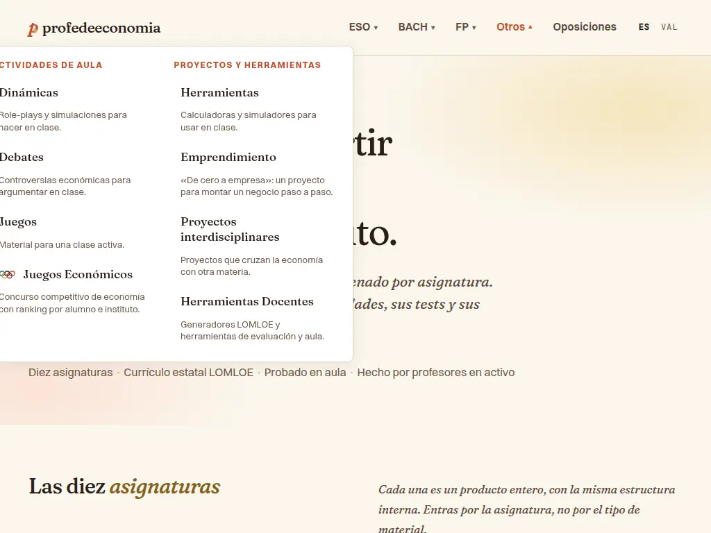
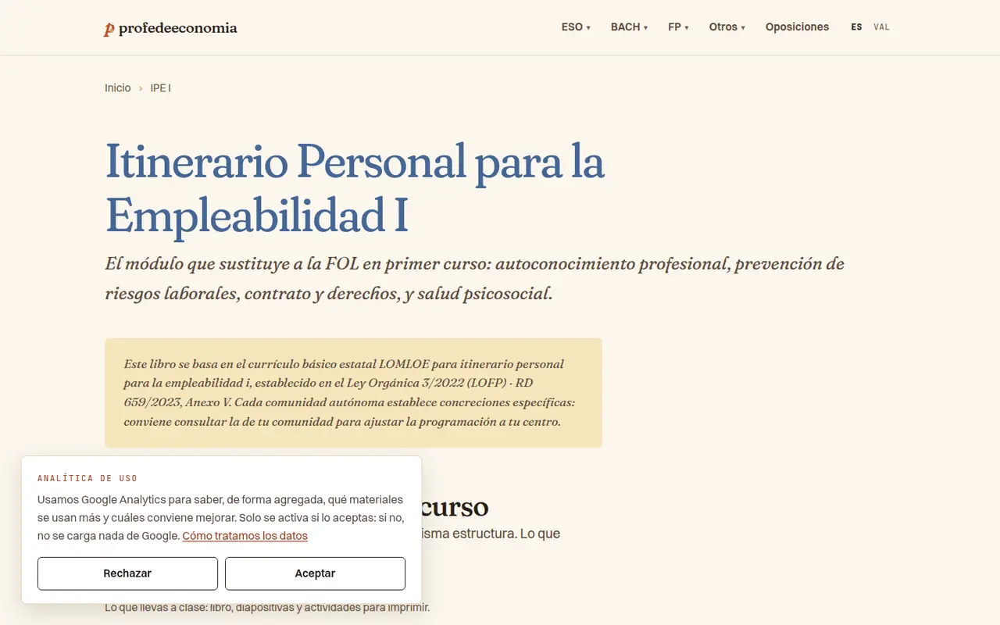
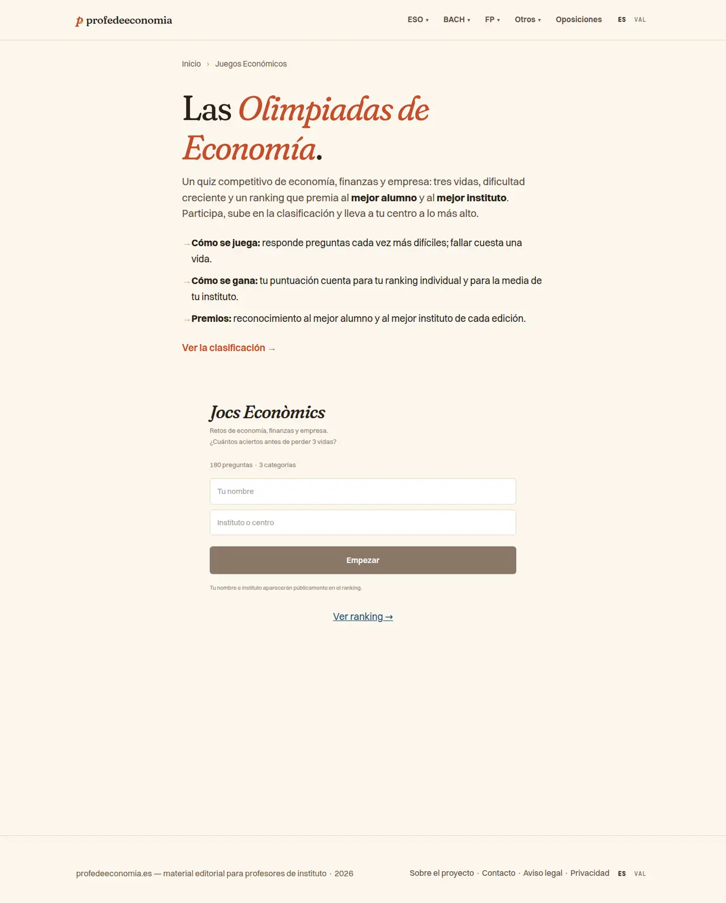
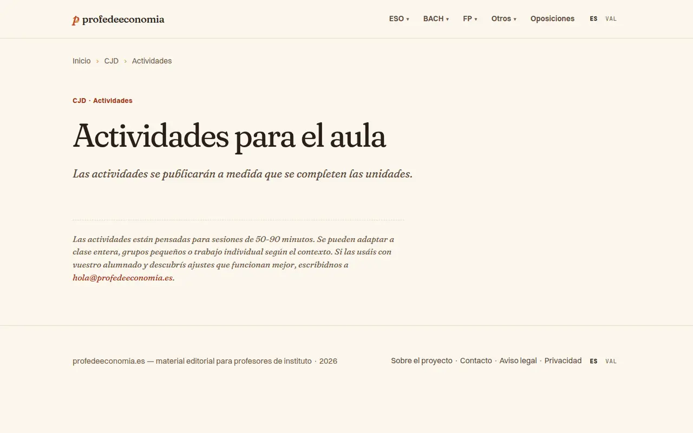
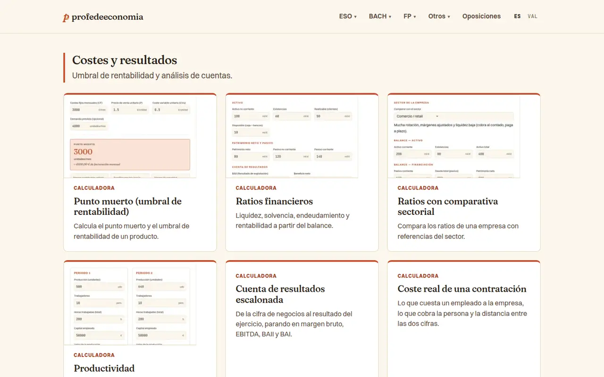
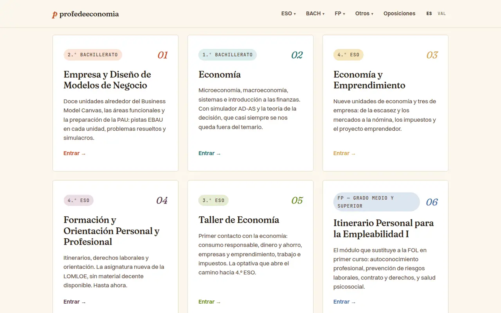
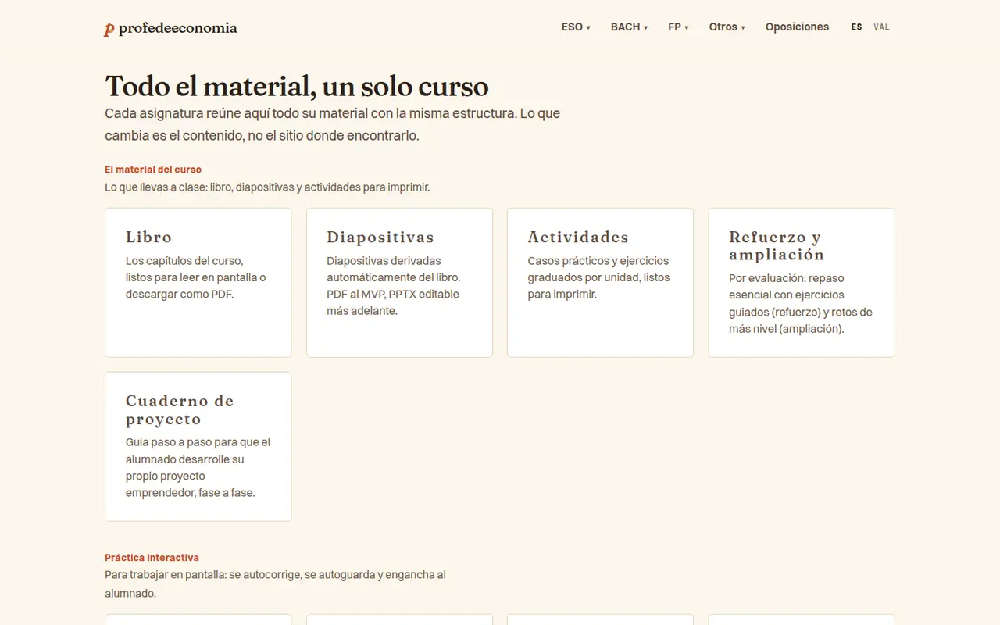
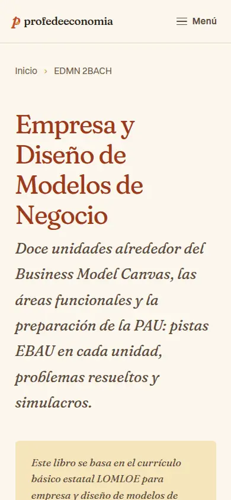

# Auditoria visual i UX/UI — Entrada, navegació i arquitectura de la informació

> Annex de l'[auditoria visual i UX/UI](./README.md) · setembre de 2026 · revisió de només lectura sobre el build de `main` (`876e002`) servit en local.

Àrea NAV · build de producció servida en local (`localhost:4321`) · 2026-09-28 · només lectura.
Les captures clau són a [`captures/`](./captures/). La resta de noms de captura que apareixen al text són material de treball de l'auditoria i no es publiquen.

**Resum**
Les portes d'entrada (home, hubs, landings transversals) segueixen bé la Variant C validada: cream i tinta marró, Fraunces amb SOFT/WONK als títols, Switzer al cos, molt d'aire i un patró d'hero coherent. El menú mòbil, el selector d'idioma i el bàner de consentiment funcionen bé. Els problemes es concentren en l'**arquitectura de la informació**. El catàleg ha passat de 4 assignatures + 3 seccions a 10 + 8 sense repensar les etiquetes: «Otros», dues «Herramientas», «Olimpiada» i «Olimpiadas», i targetes del hub que no es diuen com la pàgina on porten. A més, algunes **afirmacions ja no són certes**: «tot és LOMLOE estatal» i «la misma estructura». Hi ha un **bug de CSS** al desplegable «Otros», els filets d'accent laterals continuen en 3 landings (/herramientas/, /proyectos/, /olimpiada/) i falta contrast quan la mostassa o la terracota fan de text petit. Cap troballa és crítica: sempre es pot navegar (el clic funciona i el mòbil va bé). Recompte: **0 Crític · 7 Alt · 13 Mitjà · 5 Baix**.

**Punts forts**
- **Direcció visual fidel** a la Variant C a totes les pàgines de l'àrea. L'h1 és Fraunces a les 19 pàgines (68 px a escriptori, 44 px al mòbil) i el cos és Switzer a 1.125rem/1.7. La paleta es defineix amb tokens a `global.css`. Les fonts s'allotgen al mateix servidor, i abans del consentiment no es fa cap petició a tercers.
- **Hero de la home fidel al mockup** (`mockups/variant-c/home.html`). El resplendor radial de dalt a la dreta és el «gradiente radial muy suave» que el `mockups/README.md` documenta com a part validada de la C, i no un gradient cridaner. El pull-quote amb filets terracota a dalt i a baix és un filet horitzontal editorial, permès pel design-system.
- **Patró d'hero coherent a les landings transversals**: «*Dinámicas* para hacer en clase.», «*Debates* para argumentar…», «*Herramientas* para usar…», «*Juegos* para una clase activa.».
- **Color-coding als hubs**: l'h1 va en el color de l'assignatura, en la variant `-ink`, que passa AA (Eco 4ESO #835F20, FOPP albergínia, CJD índigo…).
- **/dinamicas/ i /debates/ ja apliquen bé el de-slop**: el color de família va al títol, les targetes tenen una vora simètrica d'1px i l'eyebrow de categoria es manté. Són el model per a les altres landings.
- **Menú mòbil sòlid** (`nav-mobile-menu-open.png`, `nav-mobile-menu-otros.png`): panell amb acordió, botons de grup de 57 px d'alt, enllaços de 39 px o més i ES/VAL de 36 px; Escape el tanca i retorna el focus al botó. A 320 px, cap de les 19 pàgines de l'àrea desborda.
- **El selector d'idioma conserva la pàgina**: 24 rutes provades porten a la seua equivalent, fins i tot la unitat 7 i el test de la U7. A /ca/, marca i menú també es queden en /ca/.
- **Consentiment correcte**: els botons Acceptar i Rebutjar són idèntics, Google no es carrega fins que s'accepta (verificat amb el tràfic de xarxa) i la decisió es pot canviar a /legal/privacidad/.
- **Accessibilitat de base**: anell de focus terracota global (`:focus-visible`), skip link, `prefers-reduced-motion` respectat, i un 404 amb punts de partida útils.
- **Pistes descartades després de verificar-les**:
  - Les «imatges sense alt» de /herramientas/, /proyectos/ i /generadores/ són un **fals positiu**: porten `alt` buit (atribut booleà), que és correcte per a miniatures decoratives.
  - Dels ~3.200 hex del repo, dins l'àrea NAV només `jocs.css` és una desviació real de la paleta (VIS-NAV-13). La resta són `var(--x, #fallback)` o valors idèntics al token.
  - `index.astro:333` és un filet horitzontal permès.
  - El `✱` no apareix a cap pàgina NAV: només és a `KeyTakeaways` (àrea d'unitats) i hi ha un `★` a /emprendimiento/proyecto/.

## Troballes

#### VIS-NAV-01 · Alt · navegació/IA — El desplegable «Otros» queda 270 px a l'esquerra del seu botó: amb el ratolí es tanca abans d'arribar-hi, i entre 861 i ~1060 px es talla
- **On**: capçalera de totes les pàgines, escriptori ≥ 861 px. `src/components/SiteHeader.astro:356-360` té la regla oberta de `.nav-dropdown--cols` (`transform: translateY(0)`). La regla genèrica de `:378-385` (`transform: translateX(-50%) translateY(0)`) té la mateixa especificitat i va després, així que guanya.
- **Evidència**:
  - El `transform` computat és `matrix(1,0,0,1,-270,0)`. A 1440 px el botó ocupa x=1009–1085 i el panell x=275–815. A 1024 px el panell comença a **x=−31** i talla «Actividades de aula», «Dinámicas»…
  - Prova de hover (moure el ratolí del botó al segon enllaç en 20 passos): BACH es queda obert; «Otros» acaba `visibility:hidden` a 1440, 1280 i 1024 px. Amb clic sí que s'obri.
  - Captures: `nav-desk-menu-otros.png`, [`nav-w1024-menu-otros`](./captures/nav-w1024-menu-otros.webp).
- **Per què importa**: «Otros» és l'única porta del menú cap a les 8 seccions transversals. Qui navega amb ratolí veu com el menú desapareix quan hi va, i en un portàtil o una tauleta horitzontal a 1024 px el panell ix tallat.
- **Proposta**: posar la regla oberta de `--cols` després de la genèrica, o pujar-ne l'especificitat: `.nav-group:is(:hover,:focus-within,.is-open) .nav-dropdown.nav-dropdown--cols { transform: translateY(0); }`. Després cal comprovar que `right:0` el deixa just davall del botó i dins de la pantalla entre 861 i 1100 px.
- **Confiança**: Alta.

#### VIS-NAV-02 · Alt · copy/to — «Tot parteix del currículum bàsic estatal LOMLOE» és fals per a 4 de les 10 assignatures i ambigu per a una cinquena, i la nota del hub ho repeteix amb errors
- **On**:
  - Home ES/CA (meta description, `hero-meta` «Currículo estatal LOMLOE», bloc «why»): `src/pages/index.astro:39,45,65-69`.
  - Nota de currículum de cada hub: `src/pages/[asignatura]/index.astro:54-55,224`.
  - FAQ, també emesa com a FAQPage JSON-LD: `src/lib/faq.ts:106`.
  - /sobre/: `src/pages/sobre.astro:14,22`.
  - Dades: `src/lib/asignaturas.ts:162,178,194,211,228`.
- **Evidència**:
  - /ipe1-fp/: «Este libro se basa en el currículo básico estatal LOMLOE para *itinerario personal para la empleabilidad i*, establecido en *el Ley Orgánica 3/2022 (LOFP)* · RD 659/2023». La LOFP no és la LOMLOE, «en el Ley» és incorrecte, i el `toLowerCase()` converteix la «I» romana en «i».
  - /gpe-bach/ i /cjd-bach/: «currículo básico estatal LOMLOE… establecido en el Decret 108/2022, mod. Decret 103/2026 (CV) — optativa. Cada comunidad autónoma establece concreciones…», quan són optatives que només existeixen a la Comunitat Valenciana.
  - EEAE sí que és estatal (RD 243/2022), però la nota hi apega el decret valencià com si fora la mateixa norma.
  - La home diu «Aquí no finjo cubrir las diecisiete: cubro la base común», i /sobre/ parla només d'«ESO y Bachillerato».
  - Captures: [`hub-ipe1--desktop`](./captures/hub-ipe1--desktop.webp), `hub-cjd--desktop.png`.
- **Per què importa**: un docent de FP o d'una altra comunitat programa a partir d'esta informació. La base normativa que s'hi afirma no és la real, la frase queda trencada (mala imatge editorial) i l'error arriba a Google a través de la FAQPage.
- **Proposta**:
  - Fer la nota condicional segons el tipus de norma (`marcoTipo: 'estatal' | 'fp' | 'autonomico'`):
    - FP → «Módulo del itinerario de FP (LO 3/2022; RD 659/2023, anexo V)».
    - CV → «Optativa del currículo de la Comunitat Valenciana (Decret 108/2022…)», sense la frase de les disset comunitats.
  - No passar el títol per `toLowerCase()`.
  - A la home i a /sobre/: «La mayoría parte del currículo estatal LOMLOE; las optativas valencianas y los módulos de FP, de su propia norma».
- **Confiança**: Alta.

#### VIS-NAV-03 · Alt · navegació/IA — «Otros» agrupa justament les seccions que CLAUDE.md diu que NO van sota «Otros»
- **On**: capçalera de totes les pàgines (escriptori i mòbil). `SiteHeader.astro:114-146`, `src/lib/asignaturas.ts:316-327`, `src/i18n/ui.ts:12-14`.
- **Evidència**:
  - CLAUDE.md diu: «3 seccions específiques amb noms propis (**no agrupades sota "Otros"**): /juegos/, /herramientas/, /emprendimiento/».
  - Ara n'hi ha 8 dins d'«Otros», en dues columnes («Actividades de aula» i «Proyectos y herramientas»).
  - El mockup validat tenia Juegos, Herramientas i Emprendimiento com a enllaços de primer nivell.
  - L'etiqueta genèrica és l'única via del menú cap a mig catàleg.
- **Per què importa**: «Otros» no diu què hi ha dins. Un docent que busca jocs o debats ho ha d'endevinar. A més, el document vinculant i el web es contradiuen.
- **Proposta** (cal validar-la): o bé una etiqueta descriptiva («Para el aula», «Recursos transversales»), o bé Juegos, Herramientas i Emprendimiento al primer nivell i la resta en un grup. Si es manté «Otros», cal esmenar CLAUDE.md.
- **Confiança**: Alta pel que fa als fets; la solució és decisió de Pau.

#### VIS-NAV-04 · Alt · navegació/IA — Noms que xoquen: dues «Herramientas» i quatre noms per a dues coses d'«Olimpiada»
- **On**:
  - Menú «Otros» i franja «Material transversal» de la home: `index.astro:56,61-62`, `asignaturas.ts:321,326-327`.
  - /jocs-economics/: `jocs-economics/index.astro:10-16`, `components/jocs-economics/screens/Welcome.tsx:41-43`.
  - BACH › Preparación: `SiteHeader.astro:87-90`.
- **Evidència**:
  - **Herramientas**: «Herramientas» (/herramientas/, calculadores) i «Herramientas Docentes» (/generadores/) tenen **el mateix CTA** a la home («Ver las herramientas →») i dos h1 que comencen igual. La PRD (`docs/PRD.md:73-75`) definia /herramientas/ com a *eines docents* (els generadors).
  - **Concurs**: el menú i el breadcrumb diuen «Juegos Económicos», l'h1 diu «Las Olimpiadas de Economía.», un segon h1 de l'aplicació diu «Jocs Econòmics» (en valencià dins la pàgina ES) i la URL és /jocs-economics/.
  - **Olimpíada oficial**: BACH › Preparación › «**Olimpiada** de Economía» (/olimpiada/) és la preparació de la prova oficial, i /juegos/ enllaça «Olimpiadas de Economía» cap al concurs.
  - Captures: [`nav-jocs-full`](./captures/nav-jocs-full.webp), `nav-home-strip-desktop.png`.
- **Per què importa**: «Olimpiada» i «Olimpiadas» porten a coses diferents (l'examen oficial i el quiz del web). Qui vol preparar la prova pot acabar al quiz, i al revés.
- **Proposta**: un nom per cosa, idèntic al menú, al breadcrumb, a l'h1, al `<title>` i al CTA.
  - /generadores/ → «Generadores y plantillas», amb el CTA «Ver los generadores».
  - Concurs → «Concurso de economía», i «Olimpiada de Economía» només per a /olimpiada/.
  - `Welcome.tsx`: passar el títol a `h2` i localitzar-lo.
- **Confiança**: Alta.

#### VIS-NAV-05 · Alt · navegació/IA — No hi ha cap camí per unitat: el hub no mostra ni les unitats ni quantitats, i la unitat no enllaça el seu test, les diapositives ni les activitats
- **On**: hubs (`src/pages/[asignatura]/index.astro:239-254`; `.section-card .count` està definit a `:396` però no es pinta mai) i unitats (p. ex. /edmn-2bach/libro/07-funcion-productiva/).
- **Evidència**:
  - El mockup validat (`mockups/variant-c/edmn-2bach.html`) tenia comptadors a cada targeta («12 unidades», «36 tests»…) i un bloc «Estructura del libro» amb les 12 unitats dins del hub. La implementació té 13 targetes per tipus, sense unitats ni números.
  - La U7 del llibre només enllaça el hub, l'índex, la U6, la U8 i una calculadora: res del test, les diapositives, les activitats, el repte o l'arbre de la U7.
  - Mesura al mòbil (390 px), camí home → test de la U7:
    - la primera targeta de la home és a y=1032;
    - «Tests» és a y=2461 dins del hub;
    - la U7 és a y=3664 dins de l'índex de tests.
    - Total: **3 tocs i ~8 pantalles de scroll**. Des del llibre U7 cap al seu test cal tornar al hub.
- **Per què importa**: el docent prepara «la unitat 7» (llibre, diapositives, test i activitats) i ara l'ha de reconstruir saltant entre cinc índexs. És la tasca central de la promesa «per assignatura».
- **Proposta**:
  1. Recuperar al hub el bloc d'unitats del mockup: una llista 01–12 on cada fila porte «Libro · Diapositivas · Test · Actividades» com a enllaços de text separats per `·` mostassa.
  2. A cada unitat, una línia «En esta unidad: Diapositivas · Test · Actividades · Reto». `RecursosRelacionados` serveix de base.
  3. Pintar el `count` de les targetes.
- **Confiança**: Alta.

#### VIS-NAV-06 · Alt · color/contrast — Mostassa i oliva com a text a les targetes de la home (2,31:1 i 3,81:1)
- **On**: / i /ca/, targetes d'Eco 4ESO («03», «Entrar →») i Taller 3ESO («Entrar →»), a totes les amplades. `src/components/SubjectCard.astro:95,113` (`color: var(--card-color)`).
- **Evidència**:
  - axe color-contrast [serious]: `.c-eco4 .num` és #D4A24C sobre blanc, 2,31:1 a 27 px (cal 3:1); `.c-eco4 .arrow` fa 2,31:1 a 16 px/600 (cal 4,5:1); `.c-taller3 .arrow` (#6B8E23) fa 3,81:1.
  - `global.css:58-74` ja té `--color-eco4-ink` (#835F20, 5,80:1) i `--color-taller3-ink` («AA-safe accent text»), i el hub ja els usa per a l'h1.
  - Captura: [`nav-home-cards-desktop`](./captures/nav-home-cards-desktop.webp).
- **Per què importa**: és l'entrada d'Eco 4ESO, una de les 4 assignatures del MVP, a la pàgina més visitada. Amb un projector o un mòbil al sol costa de llegir.
- **Proposta**: a `SubjectCard`, `.num` i `.arrow` passen a `var(--color-<x>-ink)` (un `--card-ink` per classe). El color viu es queda per a la decoració (vora en hover, píndola). Les lletres blanques sobre mostassa de la franja transversal són decoratives, però també fan 2,31:1.
- **Confiança**: Alta.

#### VIS-NAV-07 · Alt · estètica/direcció — Filets d'accent en un sol costat a /herramientas/, /proyectos/ i /olimpiada/ (regla de-slop 2)
- **On**:
  - /herramientas/: `src/pages/herramientas/index.astro:152,156`.
  - /proyectos/: `src/pages/proyectos/index.astro:139,143`.
  - /olimpiada/: `src/pages/olimpiada/index.astro:207`.
  - A escriptori i al mòbil.
- **Evidència**:
  - `.familia__head { border-left: 4px solid var(--fam-color) }`: una barra vertical al títol de família (6 a /herramientas/, 7 a /proyectos/).
  - `.card { border: 1px …; border-top: 4px solid var(--fam-color) }`: una franja de color a dalt de cada targeta (50 a /herramientas/, 18 a /proyectos/, 5 a /olimpiada/).
  - `docs/design-system.md` (de-slop 2) i CLAUDE.md: «Caixa amb vora simètrica 1px; el color funcional va a la vora sencera o al text».
  - /dinamicas/ i /debates/ ja complixen, i els hubs també (el comentari de codi diu «now that the accent stripe is gone»).
  - Captures: [`nav-herramientas-familia-desktop`](./captures/nav-herramientas-familia-desktop.webp), `nav-proyectos-familia-desktop.png`.
- **Per què importa**: és exactament el senyal que va motivar la regla vinculant, repetit 73 vegades en dues de les landings amb més targetes. També trenca la coherència amb les landings germanes.
- **Proposta**: aplicar el patró de /dinamicas/: títol de família en `var(--fam-ink)` sense `border-left`; targeta amb `border: 1px solid var(--color-line)` i, si es vol, `border-color: var(--fam-color)` només en hover. El `card__eyebrow` es queda amb el color.
- **Confiança**: Alta.

#### VIS-NAV-08 · Mitjà · tipografia — Els títols de les targetes del hub van en Fraunces minúscula amb un espaiat de 0,1em
- **On**: els 10 hubs, a totes les amplades. `src/pages/[asignatura]/index.astro:395`: `.section-card h4` anul·la `text-transform` i `font-family`, però no el `letter-spacing: 0.1em` que ve de `global.css:209-216`.
- **Evidència**: `letter-spacing` computat de 2,21 px sobre Fraunces de 22 px: «L i b r o», «D i a p o s i t i v a s», «R e f u e r z o  y  a m p l i a c i ó n». Captures: [`nav-hub-edmn-sections-desktop`](./captures/nav-hub-edmn-sections-desktop.webp), `nav-mobile-hub-edmn-s1.png`.
- **Per què importa**: és l'únic lloc del web amb minúscules espaiades en serif. Trenca la textura editorial i fa més lenta la lectura de la navegació principal del hub.
- **Proposta**: `letter-spacing: -0.01em` a `.section-card h4`, o bé un estil de títol de targeta que no hereti el d'etiqueta de l'`h4`.
- **Confiança**: Alta.

#### VIS-NAV-09 · Mitjà · tipografia/accessibilitat — A /juegos/ els noms dels jocs no van en Fraunces ni són encapçalaments
- **On**: /juegos/ i /ca/juegos/. `src/pages/juegos/index.astro:78` (`
`) i `:165`.
- **Evidència**:
  - La classe `.serif` no existeix al CSS global (només dins de `stonks.css` i `insider.css`); la font computada és Switzer 29,75 px.
  - L'esquema d'encapçalaments de la pàgina és només un h1: els 7 jocs no tenen h2 ni h3.
  - El mockup validat (`variant-c/juegos.html`) hi posa `<h3>` en Fraunces.
  - Captura: `juegos--desktop.png`.
- **Per què importa**: és una de les pàgines que més fan servir els alumnes. Els títols en sans trenquen el sistema (títols en Fraunces), i un lector de pantalla no pot saltar de joc en joc.
- **Proposta**: `<h2 class="gc-title">` amb `font-family: var(--font-serif)`. Aprofitar per revisar altres `class="… serif"` fora dels jocs.
- **Confiança**: Alta.

#### VIS-NAV-10 · Mitjà · navegació/IA — CJD: la targeta «Actividades» porta a una pàgina buida, i el hub promet una estructura que no té
- **On**: /cjd-bach/ → /cjd-bach/actividades/.
  - `src/pages/[asignatura]/index.astro:132-146`: Libro, Diapositivas, Actividades, Árboles i Programación es mostren sempre, sense comprovar si hi ha contingut.
  - `src/lib/faq.ts:114-115` («¿Qué incluye?»).
- **Evidència**:
  - /cjd-bach/actividades/ només diu «Las actividades se publicarán a medida que se completen las unidades.» i no té cap enllaç.
  - CJD no té tests, reptes, reforç ni avaluació. Tot i això:
    - el hub diu «Cada asignatura reúne aquí todo su material con la misma estructura»;
    - la FAQ diu «Cada asignatura reúne… tests de autoevaluación…»;
    - la home diu «con la misma estructura interna».
  - Captures: [`nav-cjd-actividades`](./captures/nav-cjd-actividades.webp), `shots2/hub-cjd--desktop--s01.jpg`.
- **Per què importa**: és un carreró sense eixida darrere d'una targeta que promet «Casos prácticos… listos para imprimir», i una promesa falsa fa desconfiar de la resta.
- **Proposta**:
  - Condicionar `actividades` (i qualsevol secció) a `hasX`, com ja es fa amb Tests i Retos.
  - Si es vol mantindre la targeta, marcar-la amb el badge «Próximamente» i sense enllaç.
  - Generar «¿Qué incluye?» a partir de les seccions que hi ha de veritat.
- **Confiança**: Alta.

#### VIS-NAV-11 · Mitjà · consistència — Les targetes del hub no es diuen com la pàgina on porten, i «actividades/dinámicas» vol dir tres coses
- **On**: tots els hubs → /[a]/recursos/ i /[a]/actividades-dinamicas/, més la secció transversal /dinamicas/. `src/pages/[asignatura]/index.astro:80,82`.
- **Evidència**:
  - «**Simuladores**» porta a una pàgina amb h1 «Recursos interactivos» (títol «Recursos»).
  - «**Árboles de decisión**» porta a /actividades-dinamicas/, amb h1 «Actividades interactivas».
  - Al mateix temps conviuen:
    - «Actividades» (fitxes imprimibles);
    - «Actividades de aula» (grup del menú amb dinàmiques, debats i jocs);
    - «**Dinámicas**» (role-plays transversals).
  - CLAUDE.md fixa `/recursos/` com a nom de la secció.
- **Per què importa**: el docent clica «Árboles de decisión», aterra en «Actividades interactivas» i no sap si s'ha equivocat. I «dinámicas» no vol dir el mateix al hub que al menú.
- **Proposta**: un sol nom per secció, idèntic a la targeta, l'h1, el `<title>` i el breadcrumb («Simuladores» o «Recursos interactivos», un dels dos). Reservar «Dinámicas» per a /dinamicas/ i mantindre «Árboles de decisión» també a l'h1 (la URL pot quedar com està).
- **Confiança**: Alta.

#### VIS-NAV-12 · Mitjà · layout/responsive — La capçalera del hub ocupa pantalla i mitja al mòbil i no diu el curs
- **On**: els 10 hubs, mòbil a 390 px. `src/pages/[asignatura]/index.astro:202-229`; `.subtitle` a `:292-299` fa 1.5rem fix, sense `clamp`.
- **Evidència**:
  - El primer enllaç de material («Libro») és a **y=1414**, amb una pantalla de 844. El subtítol en cursiva fa 25,5 px amb 43 px d'interlineat (7 línies).
  - Enlloc de l'hero diu «2.º Bachillerato», «FP Grado Medio y Superior» o «Optativa (CV)»: només hi ha l'acrònim del breadcrumb («CJD», «IPE I»). El mockup ho duia al kicker, que el de-slop va retirar sense recol·locar la informació.
  - Captures: [`nav-mobile-hub-edmn-top`](./captures/nav-mobile-hub-edmn-top.webp), `nav-mobile-hub-edmn-s1.png`, `hub-cjd--desktop.png`.
- **Per què importa**: l'alumne que entra des del mòbil per fer un test només veu text a la primera pantalla. El docent que arriba des de Google no sap de quin curs és la matèria.
- **Proposta**:
  - Una línia de metadades sòbria **davall** de l'h1 (no damunt), amb `·` mostassa (patró permès): «2.º Bachillerato · Modalidad CCSS · RD 243/2022».
  - `.subtitle { font-size: clamp(1.15rem, 2.4vw, 1.5rem) }`.
  - Al mòbil, la nota de currículum en un `
` o després de les seccions.
- **Confiança**: Alta.

#### VIS-NAV-13 · Mitjà · color/contrast — Terracota com a text petit sobre crema (4,36:1) i una paleta paral·lela a /jocs-economics/
- **On**:
  - Títols de grup dels 10 hubs (`[asignatura]/index.astro:336`).
  - CTA de la targeta Olimpiada a EDMN i Eco1 (`:376`; 4,02:1 sobre `bg-cream`).
  - Enllaços «imprimir» de /juegos/ (`juegos/index.astro:132`).
  - `.ver-ranking` de /jocs-economics/ (`jocs-economics/index.astro:85`) i `components/jocs-economics/jocs.css:3-14`.
- **Evidència**:
  - axe: #C44E2C sobre #FBF6EC fa 4,35:1 a 13,6 px en negreta. Per a això ja existeix `--color-terra-ink` (#9C3A1C, 6,42:1).
  - `jocs.css` redefineix la paleta:
    - `--jocs-ink-mute: #8A7868` (3,92:1), és a dir, el valor antic que `global.css` va enfosquir a #6E5A47 per complir AA;
    - un blau fora de paleta, `--jocs-blue-deep: #1F4E6E`, al segon CTA «Ver ranking →» (el primer és «Ver la clasificación →»).
  - L'avís «Tu nombre e instituto aparecerán públicamente en el ranking» és a 11 px i 3,92:1.
- **Per què importa**: les etiquetes de grup són la navegació del hub, i un avís de privacitat adreçat a menors s'ha de poder llegir.
- **Proposta**:
  - Regla general: text de menys de 24 px en `--color-terra-ink`; la `--color-terra` es reserva per a filets, fons, hover i titulars grans.
  - A `jocs.css`, mapar `--jocs-*` als tokens globals i eliminar #8A7868 i el blau.
  - L'avís del rànquing, a 13 px o més en `--color-ink-soft`, i un sol CTA de rànquing.
- **Confiança**: Alta.

#### VIS-NAV-14 · Mitjà · copy/to — La veu passa de «nosaltres» a «jo» segons la pàgina, i de «tú» a «vosotros»
- **On**:
  - Home: `index.astro:43` («El material que uso cada día») i `:69` («Aquí no finjo cubrir… cubro»).
  - /generadores/: `generadores/index.astro:44,48` («Lo que uso… mi proyecto hermano», «los mantengo… he montado aquí, por si os sirven»).
  - /emprendimiento/: `emprendimiento/index.astro:27` («todas mis asignaturas»).
  - /contacto/: `contacto.astro:12-16` («Escríbeme… indícame… lo corrijo»).
  - /sobre/: `sobre.astro:24` («Soy Pau Monterde…»).
  - En plural, en canvi: «Hecho por profesores en activo» (el mateix hero de la home), «lo que ya tenemos en FOPP e IPE» (CJD) i «escribidnos» (/cjd-bach/actividades/).
- **Evidència**:
  - El mockup validat deia «Lo que *llevamos* años usando en clase» i «no *fingimos* cubrir las diecisiete: *cubrimos* la base común»; la implementació ho ha passat al singular.
  - En el tractament, «Lo que llevas a clase» (tú, hub) conviu amb «Me interesa lo que veis» (vosotros, a /contacto/, en la mateixa frase que «Escríbeme»).
- **Per què importa**: CLAUDE.md demana «No personal de Pau… Plural». En un mateix hero conviuen «uso» i «Hecho por profesores en activo», i la incoherència es nota.
- **Proposta**: tornar al plural del mockup a la home, /generadores/ i /emprendimiento/, i triar un sol tractament (vosotros, com l'«us proposem» de CLAUDE.md). /sobre/ pot dur una signatura personal si Pau ho decidix (vegeu «Coses a validar amb Pau»).
- **Confiança**: Alta.

#### VIS-NAV-15 · Mitjà · consistència/color — Els colors de les assignatures es reutilitzen per a seccions i famílies que no són assignatures
- **On**:
  - Franja transversal de la home (`index.astro:24-33`): Herramientas = teal d'Eco1, Juegos = albergínia de FOPP, Proyectos = verd d'EEAE, Debates = granat de GPE, Juegos Económicos = oliva de Taller, Herramientas Docentes = blau d'IPE II.
  - Famílies de /debates/, /dinamicas/, /herramientas/ i /proyectos/: 41 `colorVar` a `src/lib/*.ts`. P. ex., `debates.ts:13` posa «Globalización y comercio» en el terracota d'EDMN.
- **Evidència**:
  - Recompte: `--color-fopp` ×7, `--color-eco1` ×6, `--color-ipe2` ×5, `--color-gpe` ×5, `--color-edmn` ×4…
  - A la franja hi ha dues icones «D» (Dinámicas i Debates) i una «G» per a «Herramientas Docentes».
  - Captura: `nav-home-strip-desktop.png`.
- **Per què importa**: segons CLAUDE.md, és vinculant que cada assignatura tinga el seu color identificador a la home, al hub i a les etiquetes. Si el teal també vol dir «Herramientas» i «Mercado y Estado», el color deixa d'identificar l'assignatura.
- **Proposta** (cal validar-la): una paleta secundària per a les famílies transversals (tons neutres o variacions de terracota i mostassa), o bé famílies monocromes amb el color només a l'etiqueta. Icones de la franja amb inicials úniques, o sense lletra.
- **Confiança**: Mitjana. El fet és segur; la gravetat depén de la decisió de Pau.

#### VIS-NAV-16 · Mitjà · accessibilitat — Desplegables amb `role="menu"` però sense teclat de menú, i un `aria-expanded` que no diu la veritat
- **On**: capçalera a escriptori. `SiteHeader.astro:30,34,38` (`role="menu"`/`menuitem`, `aria-haspopup`) i `:378-385` (obertura per `:focus-within`).
- **Evidència**:
  - Tabulant a ritme humà, el focus entra dins de cada desplegable perquè `:focus-within` l'obri, però `aria-expanded` es queda en «false» als 4 botons.
  - No funcionen les fletxes ni Inici/Fi, que són les tecles del patró de menú ARIA.
  - El primer enllaç del contingut arriba a la **pulsació 28**: 19 enllaços de desplegable i 4 botons pel camí. L'skip link és la pulsació 1, i això sí que està bé.
- **Per què importa**: el lector de pantalla anuncia «menú contret» quan està obert, i canvia a un mode que espera fletxes que no responen.
- **Proposta**: passar al patró *disclosure*:
  - llevar `role="menu"`, `menuitem` i `aria-haspopup`;
  - obrir només amb clic o Enter (el JS ja ho fa) i mantindre `aria-expanded` sincronitzat;
  - que `:focus-within` no òbriga el panell.
- **Confiança**: Alta.

#### VIS-NAV-17 · Mitjà · accessibilitat — `<main>` dins de `<main>`, i dos h1 a /jocs-economics/
- **On**: /contacto/ (`contacto.astro:34`), /sobre/ (`sobre.astro:57`), /legal/privacidad/ (`privacidad.astro:129`), el 404 (`404.astro:36`) i /jocs-economics/ (`index.astro:53`). `BaseLayout.astro:139` ja posa `<main id="main">`, i `Welcome.tsx:41` afegix un segon `<h1>`.
- **Evidència**: axe marca `landmark-no-duplicate-main` i `landmark-main-is-top-level` a les 5 pàgines. L'esquema de /jocs-economics/ té dos h1: «Las Olimpiadas de Economía.» i «Jocs Econòmics».
- **Per què importa**: la navegació per landmarks es fa confusa, i la pàgina té dos títols principals que competixen.
- **Proposta**: canviar `<main class="…">` per `
` o `<article>` a eixes pàgines, i posar `h2` a `Welcome.tsx`.
- **Confiança**: Alta.

#### VIS-NAV-18 · Mitjà · accessibilitat — Els filtres no exposen quin està actiu
- **On**: /herramientas/ (`herramientas/index.astro:88-91`), /dinamicas/, /debates/ i /proyectos/.
- **Evidència**: els botons `.chip` marquen el filtre actiu només amb `.is-active` (fons fosc). No hi ha cap `aria-pressed` ni a l'HTML ni al JS d'aquestes pàgines.
- **Per què importa**: amb lector de pantalla no se sap quin filtre està aplicat ni que la llista ha canviat.
- **Proposta**: `aria-pressed="true|false"` a cada chip i una regió `aria-live="polite"` que anuncie «N herramientas» en filtrar.
- **Confiança**: Alta.

#### VIS-NAV-19 · Mitjà · rendiment percebut — La maquetació salta quan arriben les fonts (CLS 0,15–0,19 al mòbil)
- **On**: la home i /herramientas/ (i les pàgines amb lede en cursiva o en Switzer), al mòbil. `BaseLayout.astro:102-108` només precarrega `fraunces-latin-normal.woff2`.
- **Evidència**: Chromium a 390 px, xarxa limitada a 1,6 Mb/s amb 150 ms de latència i sense memòria cau:
  - home: CLS **0,150**, perquè el text de l'h1, `.lede` i `.hero-meta` empeny `.subjects-section`;
  - /herramientas/: CLS **0,194** (`.lede` empeny `.filters`);
  - hub: 0,031.
  - El llindar de «bo» és 0,1.
- **Per què importa**: en el primer accés des del mòbil, el text de l'hero es recol·loca i els botons es mouen davall del dit.
- **Proposta**: precarregar també `fraunces-latin-italic.woff2` (hero, lede i subtítols en cursiva) i `switzer/switzer-400.woff2`, i afegir `@font-face` de reserva amb `size-adjust`/`ascent-override` sobre Georgia i Arial.
- **Confiança**: Mitjana, perquè la xarxa era simulada.

#### VIS-NAV-20 · Mitjà · navegació/IA — La home numera les 10 targetes de l'01 al 10 per ordre d'alta, no per etapa com fa el menú
- **On**: / i /ca/. `src/pages/index.astro:146-148`, `SubjectCard.astro:13-16` i el camp `num` a `asignaturas.ts`.
- **Evidència**:
  - L'ordre és 2.º Bach, 1.º Bach, 4.º ESO, 4.º ESO, 3.º ESO, FP, FP, 1.º Bach, Bach, Bach, mentre que el menú agrupa per ESO, BACH i FP.
  - A escriptori, la targeta 10 queda sola a l'última fila, i la píndola «FP — GRADO MEDIO Y SUPERIOR» ocupa dues línies.
  - Al mòbil la home fa 9.508 px d'alt (11 pantalles), i la franja transversal no comença fins a y=5.429.
  - Captures: [`nav-home-cards-desktop`](./captures/nav-home-cards-desktop.webp), `shots2/home--desktop--s02.jpg`.
- **Per què importa**: el docent busca la seua entre deu, i els números suggerixen un ordre que no existix.
- **Proposta**: agrupar la graella per etapa, amb els subtítols «ESO», «Bachillerato» i «FP» en el mateix ordre que el menú, i llevar o redefinir el número. Al mòbil, una targeta compacta (títol i nivell). Píndola amb text curt («FP · GM/GS»).
- **Confiança**: Alta.

#### VIS-NAV-21 · Baix · copy/to — Jerga interna, «PDF al MVP», a tots els hubs
- **On**: targeta «Diapositivas» dels 10 hubs, en ES i CA (`src/pages/[asignatura]/index.astro:75,114`).
- **Evidència**: «Diapositivas derivadas automáticamente del libro. PDF al MVP, PPTX editable más adelante.» Captura: [`nav-hub-edmn-sections-desktop`](./captures/nav-hub-edmn-sections-desktop.webp).
- **Per què importa**: «MVP» és vocabulari de producte, no de professorat, i «automáticamente» fa pensar en material fet per una màquina.
- **Proposta**: «Las diapositivas de cada unidad, sacadas del libro. Para proyectar o descargar en PDF.»
- **Confiança**: Alta.

#### VIS-NAV-22 · Baix · accessibilitat/consistència — Cada pàgina es fa les molles de pa a mà
- **On**: hubs, landings transversals i índexs. No n'hi ha a /sobre/, /contacto/, /legal/* ni al 404.
- **Evidència**:
  - Més de 15 implementacions, cadascuna amb el seu estil (un `data-astro-cid` diferent per pàgina).
  - `aria-label` només als hubs, i en anglés («Breadcrumb»).
  - Cap `aria-current="page"` i cap llista `ol/li`.
- **Per què importa**: la coherència visual és fràgil i els lectors de pantalla ho anuncien malament; a més, apareix `landmark-unique` on conviu amb altres `nav`.
- **Proposta**: un component `<Breadcrumb items={…}>` amb `nav aria-label="Ruta"`, `<ol>` i `aria-current="page"`, usat a totes les pàgines, incloses /sobre/ i /contacto/.
- **Confiança**: Alta.

#### VIS-NAV-23 · Baix · accessibilitat — El bàner de consentiment és l'últim element del document, i en triar es perd el focus
- **On**: totes les pàgines. `BaseLayout.astro:143`, `ConsentBanner.astro:96-124`.
- **Evidència**:
  - Amb teclat no s'hi arriba fins després de tot el contingut i el peu: 30 o més pulsacions de Tab a / i a /edmn-2bach/, amb la pàgina ja desplaçada fins al final.
  - Després de triar, `document.activeElement` passa a ser `<body>`.
  - (La paritat entre Acceptar i Rebutjar i el «res abans d'acceptar» són correctes.)
- **Per què importa**: al mòbil el bàner tapa un terç de la pantalla fins que l'usuari de teclat hi arriba.
- **Proposta**: posar el bàner just després del skip link dins del DOM (mantenint `position: fixed`) i, en tancar-lo, retornar el focus a `#main`.
- **Confiança**: Alta.

#### VIS-NAV-24 · Baix · microinteraccions — Detalls de la franja transversal i d'«Oposiciones»
- **On**: franja de la home (`index.astro:181,294-324`) i «Oposiciones» a la capçalera (`SiteHeader.astro:149`).
- **Evidència**:
  - A escriptori (1440 px), la fletxa de «Ver las herramientas» cau sola a la línia següent.
  - Els CTA no queden alineats a la base de les targetes.
  - «Oposiciones» porta a un altre domini sense cap avís; el mockup validat hi posava « ↗» (`variant-c/style.css:177-181`).
- **Proposta**: `&nbsp;→` o `white-space: nowrap` a la fletxa; `.strip-item { display: flex; flex-direction: column }` amb `margin-top: auto` al CTA; recuperar `::after " ↗"` a `.nav-direct[rel=external]`.
- **Confiança**: Alta.

#### VIS-NAV-25 · Baix · consistència — Les landings transversals usen dos estils de lede
- **On**:
  - Fraunces cursiva de 22–24 px: /juegos/, /generadores/, /emprendimiento/.
  - Switzer redona de 20 px: /herramientas/, /debates/, /dinamicas/, /olimpiada/, /proyectos/, /jocs-economics/.
- **Evidència**: camps `pFont`/`pSize` de `checks/capture-results.json` i les captures `shots2/*--desktop.png`.
- **Proposta**: un sol `.lede` compartit, el de la home i els hubs (Fraunces cursiva, SOFT 80, amb `clamp`).
- **Confiança**: Alta.

## Coses a validar amb Pau
1. **Veu**:
   - CLAUDE.md i el mockup validat parlen en plural («llevamos», «cubrimos»), però la implementació ha passat a «uso», «finjo», «mis asignaturas», «Escríbeme».
   - Es manté la signatura personal («Soy Pau Monterde») només a /sobre/? Pot ajudar a generar confiança.
   - Cal triar un sol tractament: «tú» o «vosotros».
2. **«Otros»**: o es manté el megamenú de 8 seccions i s'esmena CLAUDE.md, o es tornen Juegos, Herramientas i Emprendimiento al primer nivell (VIS-NAV-03).
3. **Noms**:
   - Què és «Herramientas»? La PRD diu «eines docents», i ara són les calculadores.
   - Quin nom es dona a /generadores/?
   - Quin nom porta el concurs (Juegos Económicos / Olimpiadas / Jocs Econòmics), reservant «Olimpiada» per a la prova oficial?
4. **Abast normatiu**: GPE i CJD (optatives valencianes), EEAE (part valenciana) i IPE (FP) xoquen amb dues coses de CLAUDE.md: «currículum estatal» i «adaptacions per CCAA NO al MVP». Cal decidir com es presenten (p. ex. l'etiqueta «Optativa · Comunitat Valenciana») i què es fa amb el «no fingimos cubrir las diecisiete».
5. **Color-coding**: s'admeten els colors d'assignatura per a famílies transversals, o es crea una paleta secundària (VIS-NAV-15)?
6. **Graella de la home**: s'agrupa per etapa? Què han de voler dir els números 01–10?
7. **Hub**: es recuperen els comptadors i la llista d'unitats del mockup validat (VIS-NAV-05)? On va la línia de curs i etapa (VIS-NAV-12)?
8. **Anells olímpics** a «Juegos Económicos» (menú i home): el símbol olímpic està protegit pel COI i és un risc de marca. A més, reforça la confusió amb «Olimpiada».
9. **Lemes promocionals** heretats del mockup, com «sin material decente disponible. Hasta ahora.» (FOPP) o «Para una optativa que suele caer sin material» (CJD), davant del «mai vendre, mai promocionar» de CLAUDE.md.

## Top 5
1. **VIS-NAV-01**: arreglar l'ordre de la cascada CSS del desplegable «Otros». Una regla desfeta obliga a obrir-lo amb clic i el talla entre 861 i ~1060 px; és una correcció d'una línia.
2. **VIS-NAV-02**: corregir les afirmacions normatives (LOMLOE estatal per a FP i optatives valencianes) i la nota trencada del hub («en el Ley Orgánica», «empleabilidad i»), que també ix a la FAQPage.
3. **VIS-NAV-03 i 04**: posar ordre en els noms: «Otros» contradiu CLAUDE.md, hi ha dues «Herramientas» amb el mateix CTA, i «Olimpiada» i «Olimpiadas» porten a coses diferents.
4. **VIS-NAV-05**: crear el camí per unitat: unitats i comptadors al hub, com al mockup validat, i enllaços test/diapositives/activitats des de cada unitat.
5. **VIS-NAV-07 i 06**: aplicar regles i tokens que ja existeixen: fora els filets laterals i superiors a /herramientas/, /proyectos/ i /olimpiada/ (com ja fan /dinamicas/ i /debates/), i `--color-*-ink` per als números i les fletxes de les targetes de la home (Eco 4ESO a 2,31:1).

## Captures clau
**«Otros» obert a 1024 px, desplaçat i tallat per l'esquerra (VIS-NAV-01).**

**La nota «currículo básico estatal LOMLOE… en el Ley Orgánica 3/2022 (LOFP)… empleabilidad i» (VIS-NAV-02).**

**Una pàgina, tres noms (breadcrumb «Juegos Económicos», h1 «Las Olimpiadas de Economía», h1 de l'app «Jocs Econòmics») i dos CTA de rànquing (VIS-NAV-04 i 17).**

**El carreró sense eixida de la targeta «Actividades» de CJD (VIS-NAV-10).**

**Barra lateral de 4 px al títol de família i franja superior a cada targeta (VIS-NAV-07).**

**«03» i «Entrar →» en mostassa a 2,31:1, i la píndola de FP en dues línies (VIS-NAV-06 i 20).**

**Títols espaiats («L i b r o»), «PDF al MVP» i etiquetes de grup en terracota petita (VIS-NAV-08, 13 i 21).**

**La primera pantalla del hub al mòbil, sense cap enllaç a material ni cap indicació de curs (VIS-NAV-12).**

