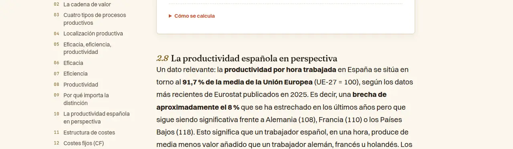
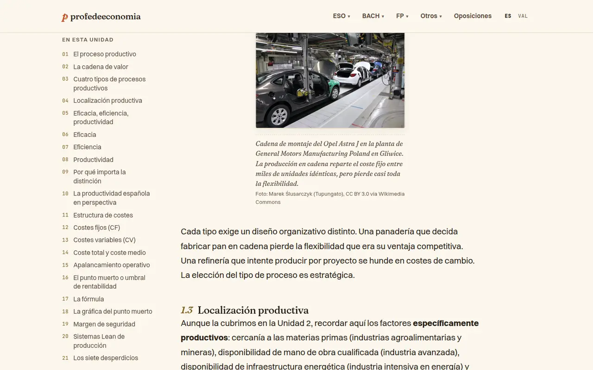
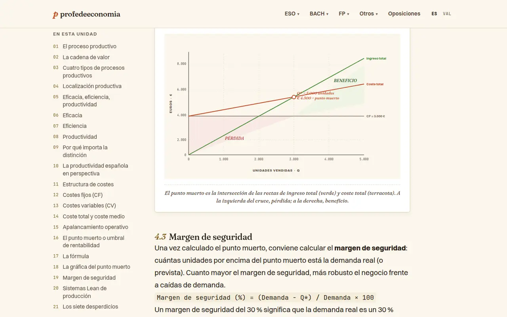
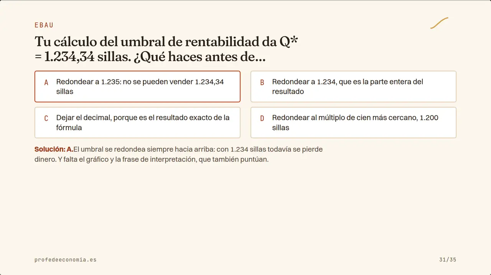
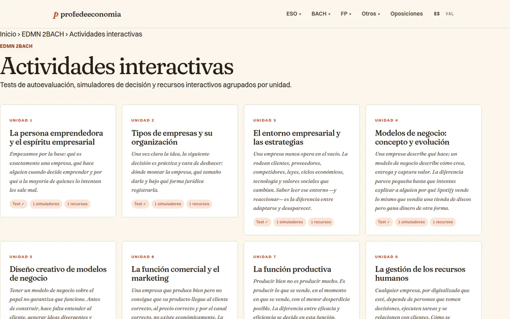
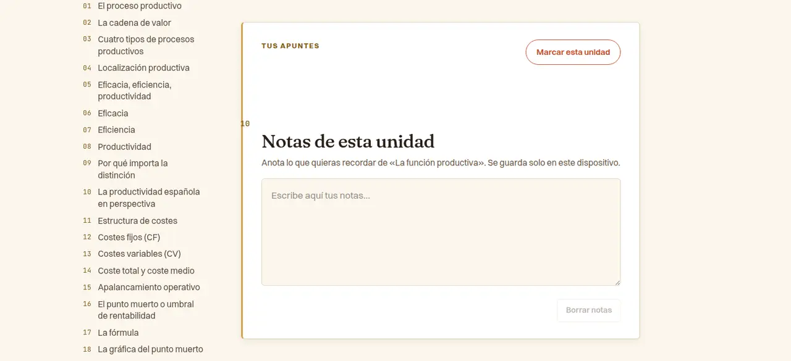

# Auditoria visual i UX/UI — Lectura, estudi i ferramentes

> Annex de l'[auditoria visual i UX/UI](./README.md) · setembre de 2026 · revisió de només lectura sobre el build de `main` (`876e002`) servit en local.

**Resum.** La «carcassa» de la Variant C està ben implementada: capçaleres de secció amb Fraunces a 68 px i entradeta en cursiva, paleta i tipografies autoallotjades, índex del llibre sobri, callouts ja «de-slopejats» i un bessó valencià net. El problema és el nucli de lectura: el reset de Tailwind 4 s'ha menjat els marges de paràgraf i les vinyetes/números de totes les llistes del llibre, i les regles globals d'encapçalament de la unitat s'escolen dins dels components (numeració de seccions trencada, etiquetes gegants). A més, hi ha fallades de contingut visual greus i mesurables: figures «wide» a mitja columna, un gràfic de punt mort amb l'eix mal etiquetat, diapositives que tallen l'enunciat o la pregunta, i un QuizPlayer que desborda i perd el focus. Queden sis focus d'incompliment de la regla de de-slop i un ús sistemàtic d'accents com a color de text per sota d'AA. Balanç: 14 Alt, 9 Mitjà, 2 Baix (cap Crític: tot té alternativa, però diverses coses són visibles per a qualsevol docent el primer dia).

**Punts forts**
- **Sistema de capçaleres coherent** a /edmn-2bach/libro/, /edmn-2bach/diapositivas/, /eco-1bach/actividades/, /edmn-2bach/recursos/, /eco-1bach/retos/, tests, /eco-4eso/programacion/ i /edmn-2bach/ebau/: mateixa vora esquerra (x=151 a 1440), etiqueta en *sentence case*, h1 Fraunces 68 px, entradeta Fraunces cursiva. Llig com a editorial, no com a plantilla.
- **Cos de la unitat dins de norma**: Switzer 20,4 px / 1,72, columna única de 726 px (68–76 caràcters per línia a escriptori), TOC lateral enganxós i caplletra terracota amb `WONK` (lec-eco4-05d-parrafos.png).
- **Components ja conformes al de-slop**: Callout («Concepto clave»), CasoDilema, Curiosity, Steps i SolvedExercise tenen radi simètric, vora 1 px neutra i tint + etiqueta (lec-u07d-_callout.png, lec-u07d-_caso.png). Verificat que MirarFora (regla de secció a tota l'amplada) i el `blockquote` d'actividades (pull-quote sense tint) **no** són slop.
- **Índex del llibre** (/edmn-2bach/libro/): llista numerada en cursiva amb separadors discontinus, molt aire, exactament l'esperit Stripe/MIT Press.
- **Bessó /ca/** complet: cap cadena castellana a la unitat 7 en valencià (UI, calculadores, diagrames), `lang="ca"` correcte, també a les diapositives.
- **Diapositives de format editorial** quan el text cap: la de cita (s03) i la de taula (s16) són exemplars per projectar (lec-deck-1920-s16.png).
- **Navegació anterior/següent** al final de cada unitat amb targetes que s'apilen al mòbil, i **ruta d'impressió** (/edmn-2bach/libro/imprimir/ amb `print`) sense problemes greus: conserva regles dels h2, vinyetes i marges (lec-print-2.png).
- **QuizPlayer** amb flux clar seleccionar → confirmar → explicació, `aria-pressed`, anell de focus terracota visible i resum final amb revisió; **calculadora de nòmina** amb jerarquia de resultats molt llegible en mòbil (shots2/calc-nomina--mobile--s02.jpg).

## Troballes

#### VIS-LEC-01 · Alt · tipografia — El cos del llibre ha perdut l'espai entre paràgrafs i els marcadors de llista
- **On**: totes les unitats (/edmn-2bach/libro/07-funcion-productiva/, /eco-4eso/libro/05-…, /cjd-bach/libro/03-…, /ca/…), tots els viewports; també les llistes de `.prose` a /edmn-2bach/actividades/07-…, /edmn-2bach/ebau/, /eco-4eso/programacion/ i els paràgrafs de /eco-1bach/refuerzo/. Causa: reset de Tailwind 4 (`src/styles/global.css:1`: `p{margin:0}`, `ul,ol{list-style:none}`) que `src/pages/[asignatura]/libro/[unidad].astro:328-333, 403-410` no restaura (només posa `::marker` mostassa i `padding`).
- **Evidència**: computat a les 3 unitats: `.article-body > p` margin 0/0 (30 de 30), `h2/h3` margin-bottom 0, **tots** els `ul/ol` del cos amb `list-style-type:none` (unitat 7: 11 `ul`, l'`ol` de «Preguntas para reflexionar» i la bibliografia). Captures: lec-eco4-05d-parrafos.png i lec-eco4-05m-parrafos.png (tres paràgrafs enganxats), lec-u07d-ul-sin-bullets.png, lec-u07d-ol-sin-numeros.png, lec-u07d-biblio.png. El mockup validat sí que en té (`mockups/variant-c/style.css:96` `p{margin:0 0 1.1em}` i `:873-882` vinyetes mostassa), i la ruta d'impressió també (lec-print-2.png).
- **Per què importa**: una unitat de 26.000–48.000 px (escriptori) es converteix en un mur de text; en projectar, el docent no pot dir «la pregunta 2» perquè les preguntes no estan numerades; les llistes perden l'estructura.
- **Proposta**: una capa `prose` compartida a `global.css` (usada per unitats, activitats, EBAU, programació i refuerzo en lloc de 6 còpies): `:where(p, ul, ol, table, pre, figure){margin:0 0 1.1em}`, `h2,h3{margin-bottom:.5em}`, `ul{list-style:disc}`, `ol{list-style:decimal}` (el `::marker` mostassa ja existeix).
- **Confiança**: Alta.

#### VIS-LEC-02 · Alt · estètica/direcció — Falta la regla superior alternant dels `<h2>` validada a la Variant C
- **On**: totes les unitats (a més d'EBAU i fases de projecte); `src/pages/[asignatura]/libro/[unidad].astro:334-342, 360-361`, `src/pages/[asignatura]/ebau/index.astro:143`, `src/pages/[asignatura]/proyecto/[fase].astro:114` — només queden els *overrides* `h2:nth-of-type(2n)::before{background:…}`, sense la regla base amb `content`.
- **Evidència**: `getComputedStyle(h2,'::before').content` = `none` (amb `background` mostassa aplicat però invisible). El mockup la defineix (`mockups/variant-c/style.css:846-858`, 4rem × 4px terracota/mostassa/teal) i `docs/design-system.md:22-23, 42` la manté explícitament. La ruta /edmn-2bach/libro/imprimir/ sí que la pinta (lec-print-2.png); la web no (lec-u07d-_article_body_h2-1.png).
- **Per què importa**: és l'únic accent que puntua regularment el llibre; sense ella les seccions es confonen i la pàgina perd l'energia cromàtica que distingia la Variant C.
- **Proposta**: restaurar `.article-body > h2::before{content:"";position:absolute;top:0;left:0;width:4rem;height:4px;border-radius:999px;background:var(--color-terra)}` (l'alternança ja hi és). Si es va treure a posta, cal actualitzar `design-system.md` i esborrar les regles òrfenes.
- **Confiança**: Alta (fet); la intenció, a confirmar amb Pau.

#### VIS-LEC-03 · Alt · consistència — La numeració de seccions és incoherent (comptadors escolats, TOC ≠ cos, número darrere del títol)
- **On**: totes les unitats; `[unidad].astro:334-390` (selectors descendents `.article-body :global(h2)`/`(h3)` que s'apliquen als encapçalaments de dins dels components) i TOC `:152-161, 302-324` (numera h2 i h3 seguits, 01–27).
- **Evidència**: simulació dels comptadors de la unitat 7: la calculadora de productivitat crea «2.5 Periodo 1», «2.6 Periodo 2», «2.7 Variación» (lec-u07d-calc-periodo.png), l'exercici resolt mostra «4.4» al costat del seu número «7.1» (lec-u07d-solved-head.png), «9.1 Bibliografía», «10» en «Notas de esta unidad» (lec-u07d-_un.png) i «11 PARA EL AULA» a 34 px en majúscules mostassa quan el component el volia a 0,8rem (lec-u07d-para-el-aula.png). Conseqüència: «La productividad española en perspectiva» apareix com **2.8** al cos i **10** al TOC (lec-u07d-numeracio-desplacada.png); «Eficacia, eficiencia, productividad» és §02 al cos i 05 al TOC. Per sota de 1100 px el número va darrere del títol perquè és un `::after` inline: «…la EPA02» (lec-eco4-m-ysel_destacado.png). Igual a l'ESO (calculadora EPA «2.3/2.4», lec-eco4-m-ysel_calc.png).
- **Per què importa**: a classe el docent diu «anem al 2.5» i el TOC de l'alumnat diu 10; les etiquetes dels components es converteixen en falsos títols de secció; sembla un error.
- **Proposta**: limitar a fills directes (`.article-body > h2`, `> h3`: el MDX els genera així), o que els components facen servir `p`/`div` amb estil propi; TOC amb el mateix esquema (§ per a h2, h3 sagnats «n.m» o sense número); en mòbil, número en bloc damunt del títol (`display:block;margin-bottom:.3rem`).
- **Confiança**: Alta.

#### VIS-LEC-04 · Alt · layout/responsive — Les figures `variant="wide"`/`"full"` surten a mitja columna i descentrades
- **On**: tots els llibres (119 figures en 77 fitxers MDX en castellà, més els bessons CA); `src/components/Figure.astro:81-91` (`max-width` + `margin-left:50%` + `translateX(-50%)` sense `width`).
- **Evidència**: a 1440 la foto «wide» de la unitat 7 fa 363 px dins d'una columna de 726 (x 621–983, desplaçada a la dreta) i a 390 fa 170 px amb un peu de 2–3 paraules per línia (lec-u07d-fig1.png, lec-u07m-fig0.png).
- **Per què importa**: les fotos pensades per a ser protagonistes es veuen com a miniatures mal alineades, en pantalla i projectades.
- **Proposta**: mentre no hi haja un *breakout* dissenyat (xocaria amb el TOC enganxós ≥1100 px), `wide`/`full` = 100 % de columna (`width:100%;margin-left:0;transform:none`). Si es vol eixir de la columna: `width:min(960px,100vw - 2*gutter)` i estendre's només cap a la dreta (`grid-column:2/4`).
- **Confiança**: Alta.

#### VIS-LEC-05 · Alt · llegibilitat/projecció — Els diagrames i gràfics SVG són il·legibles al mòbil i justos per projectar
- **On**: totes les unitats amb `<Diagram>`; `src/components/Diagram.astro:2-9` (padding 1.5rem) i `:17-22` (`svg{max-width:100%}` que anul·la el `overflow-x:auto` del contenidor); SVG amb `viewBox` de 780–880 i textos de 10–14 unitats.
- **Evidència**: unitat 7, 3 diagrames: a 390 l'SVG fa 283 px i el text més menut queda a **3,2–3,9 px**; a 1440, 670 px i 7,6–9,2 px. lec-u07m-fig3.png (gràfic del punt mort: eixos i etiquetes il·legibles), lec-u07m-fig0.png; a la diapositiva s19 a 1280×720 les marques de l'eix fan ~8 px (lec-deck-1280-s19.png).
- **Per què importa**: el gràfic és la ferramenta per a entendre el punt mort (i entra a l'EBAU); l'alumnat amb mòbil no pot llegir ni els eixos.
- **Proposta**: en ≤600 px, `svg{min-width:560px;max-width:none}` dins de l'`overflow-x:auto` existent amb indicació «desplaça →» i padding de targeta 0,75rem; botó «Ampliar» (obrir l'SVG a pantalla completa); text mínim dels SVG ≈13 unitats de `viewBox`.
- **Confiança**: Alta.

#### VIS-LEC-06 · Alt · consistència — El gràfic del punt mort té l'eix Y mal etiquetat i les zones mal dibuixades
- **On**: `src/components/diagrams/BreakEvenChart.astro:66-68, 94-98`; s'usa a EDMN U7, Eco 4ESO U10, GPE U6 i fase 4 del projecte, IPE2 U9 (+ bessons CA) i a les diapositives (`SlideDiagramMount`).
- **Evidència**: el mateix component documenta `y = 400 − v/8000·340`, però les marques «2.000/4.000/6.000/8.000» estan a y=354/272/187/103, és a dir, a **1.082 / 3.012 / 5.012 / 6.988 €**. Resultat visible: la recta «CF = 3.000 €» cau sobre la línia «4.000» i el punt «€ 4.500» queda a ~5.500 de l'eix. Els polígons usen (428,272) en lloc de la intersecció (428,209): la falca «PÉRDIDA» i l'àrea «BENEFICIO» no segueixen les rectes (lec-u07d-fig3.png, lec-deck-1280-s19.png).
- **Per què importa**: és un gràfic tipus examen; l'alumnat llig l'eix literalment i el docent el projecta.
- **Proposta**: marques a y=315/230/145/60, polígons `80,272 80,400 428,209` i `428,209 660,81 660,166`; etiqueta CF amb `--color-ink-mute` (#6E5A47; ara #8A7868, 3,9:1). Revisar els altres gràfics dibuixats a mà amb el mateix mètode.
- **Confiança**: Alta.

#### VIS-LEC-07 · Alt · llegibilitat/projecció — Les diapositives tallen enunciats i preguntes (i deixen mig slide buit)
- **On**: /edmn-2bach/diapositivas/07-funcion-productiva/ i la resta de decks (mateix CSS; el PDF es genera del mateix HTML a 1280×720); `src/styles/slides.css:47-48, 83-84, 92, 101, 147-148` (`-webkit-line-clamp` de 2–6 línies + `max-width` 46–50ch).
- **Evidència**: a 1920×1080, 8 de 35 diapositives perden text: s04 i s06 el cos (410→308 px; s04 acaba en «La diferencia estaba en cómo se…»), s21/s22 l'enunciat de l'exercici (234→141 i 281→141 px: es talla abans de la pregunta, «…entre grano,…»), s31/s32 la pregunta del quiz («¿Qué haces antes de…»), s30 una definició, s33 un concepte. Mentrestant, el 40 % dret i el terç inferior són buits (lec-deck-1920-s21.png, lec-deck-1920-s31.png, lec-deck-1920-s4.png). Els passos de la solució de s21 tampoc no tenen números (mateixa causa que VIS-LEC-01).
- **Per què importa**: el docent projecta la diapositiva per a plantejar l'exercici o la pregunta i falta justament la dada o la pregunta; com que el tall és silenciós (…), és fàcil no veure-ho abans de classe.
- **Proposta**: no retallar mai contingut de cos: dividir en dues diapositives o baixar un pas de cos quan desborde, amb una comprovació en *build* que falle si `scrollHeight > clientHeight` (com ja es fa amb les imatges); deixar `.enun` a 62–70ch perquè la meitat dreta està lliure; restaurar la numeració de `.s-exercise ol`.
- **Confiança**: Alta al web; Mitjana per al PDF (mateix CSS, no l'he obert).

#### VIS-LEC-08 · Alt · layout/responsive — El QuizPlayer desborda al mòbil i mostra Markdown en brut
- **On**: /edmn-2bach/tests/07-funcion-productiva/, /edmn-2bach/actividades-dinamicas/07-funcion-productiva/, /edmn-2bach/retos/01-empresa-innovacion-economia/; `src/components/QuizPlayer.css:14-20` (`.qp__header` flex sense *wrap*), `:39-46` (22 px + 4 px per pregunta), `:217` + `QuizPlayer.tsx:361-383` (taula «relaciona» amb `<select>` d'opcions llargues).
- **Evidència**: amplada de pàgina 459 / 434 / 470 px a 390 (i a 320). Amb emulació de mòbil real el *layout viewport* creix a 459 px i la targeta queda tallada (lec-quiz-m-ismobile.png); els `select` de «Asocia cada modalidad…» ixen de la targeta (lec-quiz-m-tipo-rel.png); asteriscs literals «*eficaz pero no eficiente*…» a la pregunta i a la revisió (lec-quiz-m-3-final.png) — 54 dels 180 fitxers de tests tenen `*…*`.
- **Per què importa**: tests, dinàmiques i reptes són la ferramenta principal de l'alumnat al mòbil; scroll lateral i controls tallats.
- **Proposta**: `.qp__header{flex-wrap:wrap}`, `.qp__progress{flex:1;min-width:0}` i `.qp__dot{flex:1 1 0;max-width:22px;min-width:4px}`; «relaciona» apilat en ≤600 px (etiqueta damunt, `select` a 100 %) i les opcions de la dreta llistades com a text (a) … b) …); renderitzar `em/strong` o netejar-los en *build*.
- **Confiança**: Alta.

#### VIS-LEC-09 · Alt · accessibilitat — QuizPlayer: el focus es perd a cada pregunta, el feedback no s'anuncia i l'encert només es marca amb color
- **On**: mateixes rutes; `QuizPlayer.tsx:184-195` (`siguiente`), `:387-393` (feedback sense `role`), `:307, 326` + `QuizPlayer.css:94-113` (estats només verd/roig); en opció múltiple el feedback no nomena l'opció correcta (`:389-391`).
- **Evidència**: prova amb teclat: després de «Siguiente →» `document.activeElement` és `BODY` i el següent Tab va al peu («Sobre el proyecto»); `.qp__feedback` sense `role`/`aria-live`; fons correcte #E5F1DD vs incorrecte #F5DDDD = 1,1:1 entre ells (vores 1,39:1), i els punts de progrés també només per color (lec-quiz-m-2-feedback.png).
- **Per què importa**: qui navega amb teclat o lector perd el lloc a cada pregunta; amb daltonisme roig-verd no se sap quina opció era la bona (WCAG 1.4.1 i 2.4.3, nivell A; 4.1.3 AA).
- **Proposta**: en canviar de pregunta, focus a l'enunciat (`tabindex="-1"`); contenidor del feedback amb `role="status"`; després de confirmar, text/icona a les opcions («✓ Correcta», «✗ Tu respuesta») i nom de l'opció correcta al feedback; punts amb text ocult.
- **Confiança**: Alta.

#### VIS-LEC-10 · Alt · microinteraccions — Calculadores: la coma decimal es perd i els números ixen en quatre formats
- **On**: /edmn-2bach/recursos/calculadora-punto-muerto/, /eco-4eso/recursos/calculadora-nomina/ i les calculadores dins de les unitats; `src/components/calculadoras/PuntoMuertoCalc.tsx:114-121` (`type="number"` + `parseFloat(value) || 0`), mateix patró en 37 dels 50 components de `calculadoras/` i cap amb `inputmode`; formats amb `toLocaleString('es-ES')` sense agrupació forçada.
- **Evidència**: Chromium amb es-ES: escriure «2,5» al preu deixa «25» i el punt mort passa de 1.500 a **123** sense cap avís; buidar un camp el torna «0». Eixides: «3000» i «≈ 4500,00 €» (punt mort) vs «1.185,69 €» i «21.000,00 €» (nòmina) vs «11.000» al costat d'entrades «20000» (EPA); entrades amb punt («1.5»); Stonks «5000 €», «2.5%», «-21.7%»; el llibre escriu «3.000 €» i «30 %» (lec-calcpm-m-error.png, shots2/calc-punto-muerto--mobile--s01.jpg, lec-stonks-m-3.png). El QuizPlayer numèric ja ho fa bé (`type="text"`, `inputmode="decimal"`, `replace(',', '.')`).
- **Per què importa**: l'alumnat espanyol escriu comes; un resultat erroni silenciós en una ferramenta per a comprovar exercicis és pitjor que un error visible, i la barreja de formats resta confiança.
- **Proposta**: component compartit `NumberField` (`type="text" inputmode="decimal"`, accepta `,` i `.`, conserva el text mentre s'escriu i valida en eixir amb missatge «Introduce un número, p. ej. 2,50») i un `fmt` comú (`Intl.NumberFormat('es-ES',{useGrouping:'always'})`, `%` amb espai fi i signe menys U+2212).
- **Confiança**: Mitjana per a l'entrada (depén de navegador i configuració regional); Alta per als formats.

#### VIS-LEC-11 · Alt · layout/responsive — «Actividades interactivas» està fora del sistema: sense contenidor ni marge lateral
- **On**: /edmn-2bach/actividades-dinamicas/ i /edmn-2bach/actividades-dinamicas/07-funcion-productiva/ (totes les assignatures); `src/pages/[asignatura]/actividades-dinamicas/index.astro:109-125` i `[slug].astro:146-160` (usen `.container`, `.breadcrumb`, `.hero`, que aquestes pàgines no defineixen; mides en px 11/15/22).
- **Evidència**: h1 a x=0 a 1440 (la resta de seccions, x=151); ruta de navegació sense estil (tinta a 19 px); al mòbil el text toca la vora (gutter 0; CLAUDE.md demana 16 px); entradeta sans de ~190 caràcters per línia; xips «1 simuladores» (plural erroni) a 11 px; simulador amb «CAJA 15000», «REPUTACION» sense accent (lec-dinhub-d-y0.png, shots2/dinamica-edmn07--mobile.png, shots2/dinamica-edmn07--desktop--s01.jpg).
- **Per què importa**: un tipus de pàgina sencer pareix trencat o a mig fer al costat de la resta de l'assignatura.
- **Proposta**: reutilitzar la carcassa de secció (contenidor 1240 + gutter `clamp`, ruta, etiqueta, entradeta Fraunces) —idealment un `SectionHeader.astro` compartit— i mides en rem; xips → línia de text amb `·` mostassa («Test · 1 simulador · 1 recurso»).
- **Confiança**: Alta.

#### VIS-LEC-12 · Alt · color/contrast — Accents com a color de text per sota d'AA i CTA de descàrrega amb text fosc sobre terracota
- **On**:
  - CTA de descàrrega (CSS copiat en 8 plantilles —índex del llibre, activitats, fitxa, programació, EBAU, projecte, debat, emprenedoria— i mesurat en 6 pàgines): `src/pages/[asignatura]/libro/index.astro:213-247` + `src/styles/global.css:219` (`strong{color:ink}` guanya al blanc heretat) → «Descargar libro completo» #2A1F18 sobre #C44E2C = **3,42:1**, subtítol amb `opacity:.75` = 3,32:1 (lec-libidx-d-y0.png).
  - Botons crema sobre terracota 4,36:1 («Descargar PDF», «Abrir recurso», «Empezar reto», «Confirmar respuesta»); text terracota sobre crema 4,36:1 («Volver a la unidad», enllaços de «Para el aula» `RecursosRelacionados.astro:63`) i 4,02:1 sobre #F5EDD9 (Stonks).
  - Mostassa com a text: 2,1–2,3:1 als nivells d'assoliment i codis CE de /eco-4eso/evaluacion/ (`evaluacion/index.astro:165, 175-177, 192`, lec-eval-d-ysel_rubrica.png), «AMPLIACIÓN» a refuerzo (`refuerzo/index.astro:175-180`), «DEBATE EN CLASE» (`RecursoDestacado.astro:24`), «vs» de VocesDesacuerdo (1,98:1).
  - Verd #4F8C3F als valors de les calculadores: 3,78:1.
- **Evidència**: axe `color-contrast` (serious) en 24 de les 26 pàgines del meu abast (p. ex. 64 nodes a /eco-1bach/actividades/, 29 a /eco-4eso/evaluacion/); ràtios recalculats.
- **Per què importa**: les etiquetes de nivells i els CTA són justament el que es projecta i el que es llig al mòbil a plena llum; incompleix AA.
- **Proposta**: fer servir els tokens que ja existeixen: text en `--color-terra-ink` (6,42:1) i `--color-{assignatura}-ink` (eco4 #835F20 = 5,8:1 sobre blanc) en lloc de la base; botons amb text blanc (4,69:1) o fons `terra-deep` (6,92:1); CTA `.download-cta__text strong{color:inherit}` i sense opacitat, en un únic `DownloadCta.astro`; verd de resultats #2A5A1F.
- **Confiança**: Alta.

#### VIS-LEC-13 · Alt · estètica/direcció — Incompliments de la regla de de-slop: ratlles d'accent d'un sol costat i ✱
- **On**:
  - Notes de la unitat (a totes les unitats): `[unidad].astro:507-515`, `border-left:3px solid` mostassa sobre caixa blanca (lec-u07d-_un.png).
  - EBAU (68 `blockquote`) i programació: `ebau/index.astro:153`, `programacion/index.astro:185-188` — ratlla esquerra + tint crema + `border-radius:0 4px 4px 0`, és a dir, el *tell* exacte, i s'usen per a avisos («Aviso:», «Cómo usar esta batería»), no per a cites (lec-ebau-m-blockquote.png).
  - Fases del projecte: `proyecto/index.astro:184` (`border-top:3px` a les targetes; shots2/proyecto-edmn--desktop--s01.jpg).
  - Debat: `src/components/debates/Argumentario.astro:12` (`border-top:3px` a favor/en contra; shots2/debate--desktop--s01.jpg).
  - Generador DUA: `src/components/generadores/MedidasDUA.tsx:340-348` (principis amb `border-top:3px`; el design-system posa els principis DUA com a exemple de «vora sencera»).
  - Regla 4: `src/components/KeyTakeaways.astro:26-28` pinta `✱` dins d'un cercle mostassa a «Lo esencial…» (186 fitxers de contingut; lec-u07d-_takeaways.png).
- **Evidència**: codi i captures citades; les regles són a `docs/design-system.md` §«Fora» 2 i 4.
- **Per què importa**: són normes vinculants arran de la crítica pública; la de les notes apareix al final de cada unitat i la ✱ gairebé a totes.
- **Proposta**: patró del design-system: vora 1 px `--color-line` i radi simètric; avisos d'EBAU/programació amb `<Callout>` (tint + etiqueta) o `blockquote` sense tint ni radi; colors categòrics (a favor/en contra, DUA, fases) a la vora sencera o al text de l'etiqueta; KeyTakeaways sense icona o amb un signe tipogràfic (`—`).
- **Confiança**: Alta.

#### VIS-LEC-14 · Alt · layout/responsive — Taules que fan desplaçar tota la pàgina en mòbil
- **On**: /edmn-2bach/actividades/07-punto-muerto-restaurante/ (410 px), /edmn-2bach/ebau/ (7 taules més amples que la columna, fins a 625 → pàgina de 651 px), a 320 px també /eco-4eso/programacion/ (371) i /debates/mercado-estado/01-salario-minimo/ (380); `.prose table{width:100%}` sense contenidor a `actividades/[slug].astro:313`, `ebau/index.astro:150` i `programacion/index.astro:173` (la unitat sí que ho resol a `[unidad].astro:415-434`, però sense indicació visual ni focus: axe `scrollable-region-focusable` a /eco-4eso/libro/05-… i /cjd-bach/libro/03-…).
- **Evidència**: lec-act-m-ysel_prose.png («PLAN B — AUTOMATIZADO» tallat, «25.000 / €» partit en dues línies), lec-ebau-m-tabla.png (columnes «Valor por cuestión» i «Optatividad» fora de pantalla).
- **Per què importa**: la preparació d'EBAU es fa molt amb el mòbil; el desplaçament lateral de tota la pàgina trenca la lectura.
- **Proposta**: la regla de taula de la unitat a la capa `prose` compartida + `tabindex="0"`, `role="region"`, `aria-label` i ombra/degradat a la vora dreta quan hi ha scroll; xifres amb `white-space:nowrap`; per a taules de 2–3 columnes, targetes apilades en ≤600 px.
- **Confiança**: Alta.

#### VIS-LEC-15 · Mitjà · navegació — Unitats i EBAU molt llargues sense ajudes per a orientar-se
- **On**: unitats en mòbil i /edmn-2bach/ebau/; `[unidad].astro:119-161` (fitxa + TOC abans de l'article, sense plegar ni ressaltar la secció activa); encapçalaments amb `scroll-margin-top:0` sota una capçalera enganxosa de 73–80 px.
- **Evidència**: a 390 el primer paràgraf real arriba a 5.131 / 6.764 / 5.810 px (6,1 / 8,0 / 6,9 pantalles) després de: fitxa amb objectius, TOC de 27 entrades (857–892 px), `blockquote` que repeteix els objectius (98 de 98 unitats), TL;DR i cas. Les unitats fan 54–102 pantalles de mòbil, sense barra de progrés, «tornar a l'índex» ni secció activa. Clicar «16 El punto muerto…» deixa l'encapçalament sota la capçalera (top 0, capçalera 80 px; lec-u07d-anchor.png). EBAU: 105.000 px de mòbil, tres `<h1>` i cap índex intern.
- **Per què importa**: l'alumnat fa 6–8 pantalles de scroll abans de llegir i es perd; en tornar d'un enllaç del TOC no veu on ha caigut.
- **Proposta**: `h2,h3{scroll-margin-top:6rem}`; en <1100 px, TOC dins d'un `
` («En esta unidad · 9 secciones») només amb h2; illa lleugera amb secció activa, barra de progrés fina i enllaç flotant «↑ Índice»; eliminar un dels dos llistats d'objectius; EBAU en tres pàgines o amb índex + un sol h1.
- **Confiança**: Alta.

#### VIS-LEC-16 · Mitjà · consistència — «Sabers» (valencià) a la primera línia de les 98 unitats en castellà
- **On**: `src/pages/[asignatura]/libro/[unidad].astro:114` (text fix) i «Sabers LOMLOE» dins del MDX de 4 unitats en castellà.
- **Evidència**: 98 de 98 pàgines en castellà mostren «Unidad 7 · Bloque B · Sabers B.3» (lec-u07m-y0.png).
- **Per què importa**: és la primera línia de cada unitat; el docent pot copiar-ho a la programació.
- **Proposta**: afegir `sabers: 'Saberes' / 'Sabers'` a l'objecte `copy` (`:41-44`) i corregir els 4 MDX.
- **Confiança**: Alta.

#### VIS-LEC-17 · Mitjà · tipografia — Els components de la unitat baixen a 15,6–17 px i barregen serif i sans al cos
- **On**: `Curiosity.astro` (0,98rem), `Steps.astro` (1rem), `SolvedExercise.astro` (1rem), `KeyTakeaways` (0,98rem), `PistaEbau` i `VocesDesacuerdo` (0,95rem), MirarFora «para clase» (0,92rem); cos en Fraunces a `TldrUnidad`, `CasoDilema` (1rem, tinta suau) i MirarFora; `VocesDesacuerdo.astro:22, 55` (un `h4` que hereta `text-transform:uppercase`).
- **Evidència**: prosa 20,4 px vs components 15,6–17,3 px (el mínim de CLAUDE.md és 1,125rem = 19,1 px); l'exercici resolt, que és el que més es projecta, va a 17 px (lec-u07d-_solved_exercise.png); el cas en serif 17 px gris (lec-u07d-_caso.png); el títol de Voces surt en majúscules cursives espaiades mentre Curiosity no (lec-eco4-m-ysel_voces.png).
- **Per què importa**: salts de 20 a 16 px cada pocs paràgrafs; solucions menudes en projectar; contradiu «Cos: Switzer».
- **Proposta**: cos dels components ≥1,125rem (notes secundàries com a molt 1,05rem), Switzer per al cos i Fraunces només per a títols, entradetes i cites; `.voces__tema{text-transform:none;letter-spacing:-.005em}`.
- **Confiança**: Alta (mesures); el gust, a validar.

#### VIS-LEC-18 · Mitjà · accessibilitat — Steps amb llistes Markdown: `<ol>` dins d'`<ol>` i text esprémut al mòbil
- **On**: /cjd-bach/libro/03-constitucion-y-poderes-del-estado/; `src/components/Steps.astro:29-31`; 38 usos comencen amb una llista numerada Markdown.
- **Evidència**: axe `list` (serious); DOM `<ol class="steps__list"><ol><li>…`; a 390 el text comença a x≈152 (doble sagnat: `ol` de l'article 1,4rem + `li` 3rem) i fa 3–4 paraules per línia (lec-cjd03-m-ysel_steps.png).
- **Per què importa**: el lector de pantalla anuncia llistes niades buides i el pas a pas es fa pesat de llegir al mòbil.
- **Proposta**: que el component accepte la llista Markdown (estilar `:global(ol)` interior amb padding 0 i embolcall `div`) o validar en *build* que el slot siga `<li>`; `padding-left` de 2,6rem en ≤600 px.
- **Confiança**: Alta.

#### VIS-LEC-19 · Mitjà · navegació — L'índex d'activitats són 60 targetes planes, sense agrupar per unitat
- **On**: /eco-1bach/actividades/ (igual a la resta); `src/pages/[asignatura]/actividades/index.astro:147-148, 274-302`.
- **Evidència**: 60 targetes, 0 filtres, cap `h2` per unitat (axe `heading-order`: h3 just després de l'h1); el número gran és la unitat i es repeteix («01, 01, 01, 01, 01, 02…»); 11.487 px a escriptori i 31.621 px al mòbil; 10 tipus amb només 5 parelles de color (debat i investigació, teal; cas i notícia, terracota; dinàmica i creatiu, albergínia) (lec-actidx-d-grid.png).
- **Per què importa**: qui busca activitats per a la unitat 7 ha de fer scroll per 40 targetes.
- **Proposta**: agrupar per unitat amb `<h2>Unidad 1 · Título</h2>` i salts (U1…U12) al capdamunt, o filtre per unitat/tipus; substituir el «01» per «U1» o eliminar-lo (el grup ja ho diu).
- **Confiança**: Alta.

#### VIS-LEC-20 · Mitjà · layout/responsive — Refuerzo col·loca contingut llarg en dues columnes paral·leles
- **On**: /eco-1bach/refuerzo/; `src/pages/[asignatura]/refuerzo/index.astro:158` (`.bloques` en dues columnes) amb teoria llarga dins de `BloqueRefuerzo`.
- **Evidència**: a 1440, dues columnes de 557 px que fan 9.690 i 8.444 px d'alt per avaluació (≈11 pantalles cadascuna), paràgrafs sense marge (shots2/refuerzo--desktop--s02.jpg).
- **Per què importa**: CLAUDE.md demana una sola columna per al contingut llarg; cal llegir una columna sencera i tornar a pujar per l'altra.
- **Proposta**: una columna (66ch) amb Refuerzo i després Ampliación, o pestanyes per avaluació; targetes només per al resum i la descàrrega.
- **Confiança**: Alta.

#### VIS-LEC-21 · Mitjà · llegibilitat/projecció — El visor de diapositives no té controls i els quiz/exercicis ensenyen la solució de sortida
- **On**: /edmn-2bach/diapositivas/07-funcion-productiva/; `src/components/slides/Deck.astro:10-28` (només scroll amb fletxes); `slides.css` `.s-quiz .opt--ok`, `.expl` i `.s-exercise ol`.
- **Evidència**: la pàgina té 0 enllaços i 0 botons (ni tornar a la unitat, ni pantalla completa, ni índex de diapositives); en projectors 4:3 (1024×768) es veuen les veïnes. La s31 mostra l'opció correcta marcada i «Solución: A.» junt amb la pregunta, i la s21 l'enunciat amb la solució (lec-deck-1920-s31.png, lec-deck-1920-s21.png).
- **Per què importa**: el docent no pot plantejar la pregunta a la classe sense revelar la resposta, i no té una manera evident de passar a pantalla completa o tornar.
- **Proposta**: barra mínima (← Unidad, n/35, ⛶ amb l'API Fullscreen, tecles F/Esc), oculta en impressió; revelar la solució amb la següent pulsació o en la diapositiva següent.
- **Confiança**: Alta (fets); el disseny, a validar.

#### VIS-LEC-22 · Mitjà · consistència — Capçaleres dispars entre seccions de la mateixa assignatura
- **On**: /eco-1bach/refuerzo/ (sense etiqueta, entradeta sans), /eco-4eso/evaluacion/ (x=221, sense etiqueta, sans), /edmn-2bach/proyecto/ (sense etiqueta), actividades dinàmiques (x=0), /juegos/teoria-juegos/ (h1 de 42 px, etiqueta en majúscules terracota, x=270), /generadores/rubricas/ (x=321, sans, tres introduccions), debat (x=361, h1 teal, sans), davant del patró comú (x=151, etiqueta, h1 68 px, entradeta Fraunces cursiva).
- **Evidència**: mesura amb script (posició, mida i família de l'h1 i l'entradeta); shots2/refuerzo--desktop.png, lec-eval-d-y0.png, shots2/teoria-juegos--desktop.png.
- **Per què importa**: en saltar entre seccions d'una mateixa assignatura el títol «balla» i canvia de veu.
- **Proposta**: un `SectionHeader.astro` compartit (ruta, etiqueta, h1, entradeta, meta).
- **Confiança**: Alta.

#### VIS-LEC-23 · Mitjà · accessibilitat — Deutes menors d'accessibilitat repetits
- **On**: `Curiosity.astro:18` i Steps (`h4` just després d'`h2`), targetes `h3` sense `h2` als índexs (diapositives, activitats, recursos, reptes); `[unidad].astro:101` (ruta `<nav>` sense `aria-label`, conflicte de *landmark*); EBAU amb 3 `<h1>`; `th` buit a la diapositiva de taula i a EBAU; `PuntoMuertoCalc.tsx` (`.calc__results` i `.calc__warning` sense `aria-live`/`role`).
- **Evidència**: axe `heading-order`, `landmark-unique`, `empty-table-header`; prova de l'avís «El precio debe ser mayor…» sense rol (lec-calcpm-m-error.png).
- **Per què importa**: navegar per encapçalaments o regions dona una estructura falsa; els canvis de resultat no s'anuncien.
- **Proposta**: nivells correlatius (h3 dins d'h2, o `p` amb estil per a títols de components), `aria-label="Ruta"` a la ruta, un sol h1 a EBAU, text ocult a les cel·les de cantonada i `aria-live="polite"` a resultats i avisos.
- **Confiança**: Alta.

#### VIS-LEC-24 · Baix · layout/responsive — Generador de rúbriques: la taula no cap a escriptori i la introducció es repeteix
- **On**: /generadores/rubricas/.
- **Evidència**: a 1440, dins d'una columna de ~800 px, la columna «Sobresaliente» queda tallada a la vora de la targeta; tres frases seguides diuen el mateix (entradeta, subtítol i paràgraf) (shots2/generador-rubricas--desktop.png).
- **Proposta**: editor a tota l'amplada del contenidor (1240) a partir de 1100 px; una sola frase d'introducció.
- **Confiança**: Alta.

#### VIS-LEC-25 · Baix · microinteraccions — Stonks: controls −/+ de 30 px a salts del 5 %
- **On**: /juegos/stonks/ (pantalla de joc).
- **Evidència**: botons de 30×30 px; posar un actiu al 50 % demana 10 tocs, per actiu i per ronda, en 25 rondes (lec-stonks-m-3.png).
- **Proposta**: objectius de 44 px, lliscador o toc sobre el % per a escriure'l, i dreceres 0/25/50/100.
- **Confiança**: Alta.

## Coses a validar amb Pau
1. **Regla sobre els `h2`** (VIS-LEC-02): recuperar-la tal com era al mockup o donar-la per retirada i actualitzar `design-system.md`.
2. **Colors d'assignatura com a accents genèrics**: «Ejemplo real» (`RealExample.astro`) fa servir l'albergínia de FOPP a totes les assignatures (també dins d'Eco 4ESO i EDMN, lec-eco4-m-ysel_real_example.png); Teoría de juegos pinta cada targeta amb colors d'assignatura; les insígnies d'activitats reutilitzen teal, albergínia, etc. El color-coding per assignatura és vinculant: cal decidir si aquests usos el dilueixen.
3. **Insígnies en píndola** dels tipus d'activitat i xips de les dinàmiques: són «badges de text» permesos o «xips decoratius» de la regla 3?
4. **Fraunces com a cos** dins de TL;DR, Cas i «Mirar fora», i descripcions de targeta de 7 línies en cursiva: toc editorial desitjat o excepció a «Cos: Switzer»?
5. **Mida del cos al mòbil**: 1,2rem sobre `html` de 17 px dona 20,4 px i ~30–33 caràcters per línia; baixar a 1,125rem (19,1 px, encara dins de norma) en ≤600 px guanyaria un 7 % de línia.
6. **Diapositives per a projectar**: revelar solucions de quiz/exercici en un segon pas i quin CTA és el principal a l'índex («Descargar PDF» o «Ver/Proyectar»).
7. **Figures amples**: han d'eixir de la columna (cal dissenyar-ho amb el TOC enganxós) o quedar-se a l'amplada de la columna?
8. **Etiquetes damunt de l'h1 sense ✱** («EDMN 2BACH · Libro»): es mantenen com a *house style* (i s'afegeixen on falten) o es retiren arreu?

## Top 5
1. **VIS-LEC-01** — Paràgrafs sense separació i llistes sense vinyetes ni números a tot el llibre: és la base de la lectura i afecta totes les unitats.
2. **VIS-LEC-07** — Diapositives que tallen l'enunciat o la pregunta (8 de 35 a la U7): el material de projecció falla just on més es fa servir.
3. **VIS-LEC-08 + VIS-LEC-09** — QuizPlayer: desbordament al mòbil, focus perdut i encert només per color, en tests, dinàmiques i reptes.
4. **VIS-LEC-04 + VIS-LEC-05** — Figures «wide» a mitja columna (119) i diagrames SVG a 3–5 px al mòbil.
5. **VIS-LEC-06 + VIS-LEC-10** — Dades numèriques errònies: eix Y del gràfic del punt mort mal etiquetat (5 unitats i diapositives) i coma decimal que les calculadores converteixen en un altre número.

## Captures clau
**Tres paràgrafs de la unitat d'ESO enganxats, sense cap separació (VIS-LEC-01).**

**La mateixa secció és «2.8» al cos i «10» al TOC (VIS-LEC-03).**

**Figura `wide` a mitja columna i desplaçada a la dreta (VIS-LEC-04).**

**Gràfic del punt mort: «CF = 3.000 €» sobre la línia 4.000 i zones fora de les rectes (VIS-LEC-06).**

**Pregunta de quiz tallada («¿Qué haces antes de…») amb la solució ja visible (VIS-LEC-07, VIS-LEC-21).**

**QuizPlayer a 390 px: punts de progrés i desplegables fora de la targeta (VIS-LEC-08).**

**«Actividades interactivas» enganxada a la vora esquerra, sense contenidor (VIS-LEC-11).**

**Notes de la unitat amb ratlla mostassa lateral i el comptador «10» escolat (VIS-LEC-13, VIS-LEC-03).**

